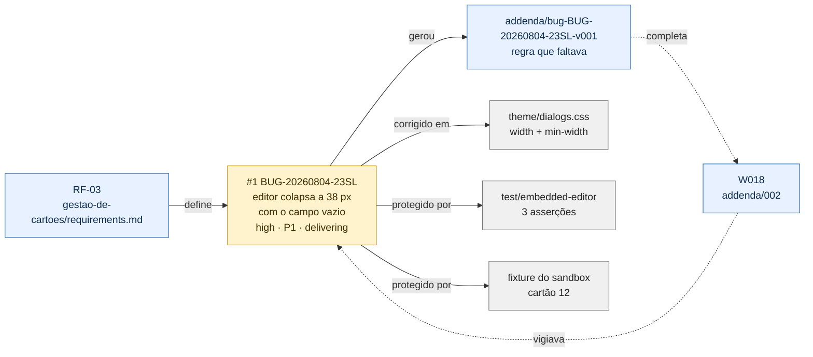

# Grafo de bugs — gestao-de-cartoes

> View gerada em 2026-08-04. Não editar à mão.

```mermaid
graph LR
    classDef open fill:#fff3cd,stroke:#b8860b,color:#3d2c00
    classDef spec fill:#e7f1ff,stroke:#2c6bb3,color:#0d2b4d
    classDef code fill:#f0f0f0,stroke:#777,color:#222

    B1["#1 BUG-20260804-23SL<br/>editor colapsa a 38 px<br/>com o campo vazio<br/>high · P1 · delivering"]:::open

    S1["RF-03<br/>gestao-de-cartoes/requirements.md"]:::spec
    S2["W018<br/>addenda/002"]:::spec
    S3["addenda/bug-BUG-20260804-23SL-v001<br/>regra que faltava"]:::spec

    C3["theme/dialogs.css<br/>width + min-width"]:::code
    T1["test/embedded-editor<br/>3 asserções"]:::code
    T2["fixture do sandbox<br/>cartão 12"]:::code

    S1 -->|define| B1
    S2 -.->|vigiava| B1
    B1 -->|corrigido em| C3
    B1 -->|protegido por| T1
    B1 -->|protegido por| T2
    B1 -->|gerou| S3
    S3 -.->|completa| S2
```

Nenhuma aresta BUG↔BUG: o contexto tem um único bug registrado.
