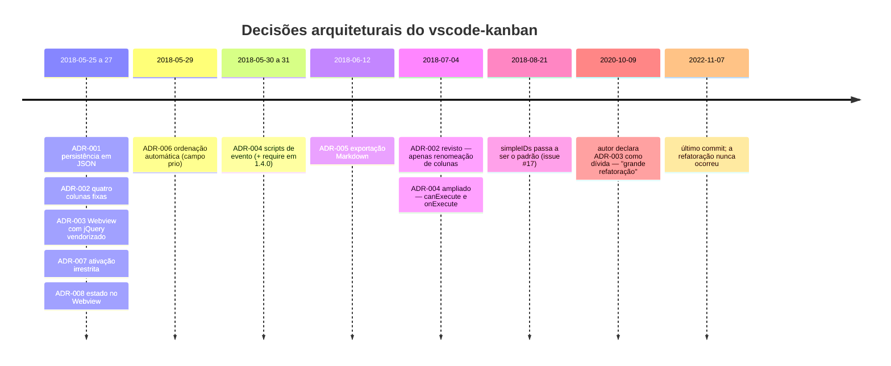

# ADRs retroativos — vscode-kanban

> Reconstruídos pelo **Detetive** (Reversa) em 2026-08-02 a partir do código, de 86 commits
> (2018-05-25 a 2022-11-07) e do `CHANGELOG.md`.
>
> ⚠️ **Nenhum destes ADRs existia no projeto.** São reconstruções: a decisão e suas
> consequências são 🟢 CONFIRMADAS pelo código; a *motivação* é 🟡 INFERIDA, salvo onde o
> autor a declarou por escrito.

| # | Decisão | Status | Impacto | Revisar? |
|---|---|---|---|---|
| [001](001-persistencia-em-json-no-workspace.md) | Persistir o quadro em JSON dentro de `.vscode/` | Vigente | Alto | Não — decisão sólida; corrigir a implementação |
| [002](002-quatro-colunas-fixas.md) | Quatro colunas fixas, renomeáveis só na exibição | Vigente | Alto | Talvez — custo de mudança elevado |
| [003](003-interface-em-webview-com-jquery-vendorizado.md) | Webview com jQuery, Bootstrap e afins vendorizados | Vigente | Alto | **Sim** — dívida declarada pelo próprio autor |
| [004](004-execucao-de-script-do-workspace.md) | Extensibilidade por execução de script do workspace | Vigente | Alto | **Sim** — sem mitigação de segurança |
| [005](005-exportacao-markdown-com-limpeza-por-glob.md) | Exportação Markdown com limpeza por glob | Vigente | Médio | **Sim** — apenas a limpeza |
| [006](006-ordenacao-automatica-em-vez-de-ordem-manual.md) | Ordenação automática, sem ordem manual | Vigente | Médio | Talvez — corrigir a mutação in place é barato |
| [007](007-ativacao-irrestrita-da-extensao.md) | `activationEvents: ["*"]` | Vigente | Médio | **Sim** — melhor relação benefício/esforço |
| [008](008-estado-autoritativo-no-webview.md) | Estado autoritativo do quadro no Webview | Vigente | Alto | **Sim** — bloqueia tipos, módulos e testes |

## Linha do tempo das decisões

## Leitura de conjunto

Cinco das oito decisões foram tomadas nos **três primeiros dias** do projeto e nunca foram
revistas. Isso não é descuido: é o padrão de um projeto que atingiu cedo o que se propunha e
depois entrou em manutenção. Das 86 mudanças registradas, as vinte e poucas com conteúdo
funcional concentram-se entre maio e agosto de 2018; tudo o que veio depois é atualização de
dependência e compatibilidade com versões do editor.

A decisão que trava as demais é a **ADR-008**: com o domínio morando no Webview, em JavaScript
global e sem tipos, qualquer melhoria estrutural esbarra na impossibilidade de testar. Foi
provavelmente o que o autor entendeu ao anunciar a "grande refatoração" em 2020 — e o que
tornou a tarefa grande demais para ser feita sozinho.
