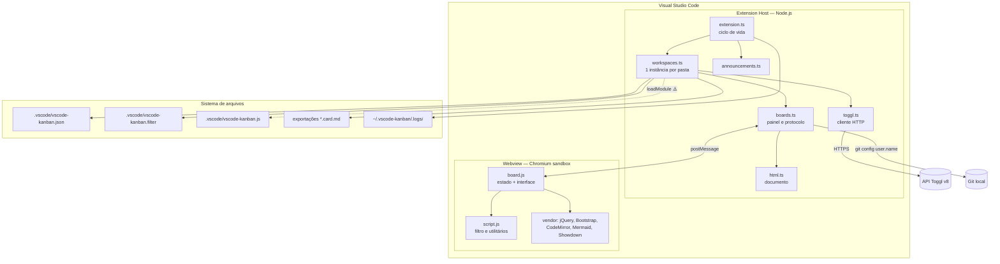
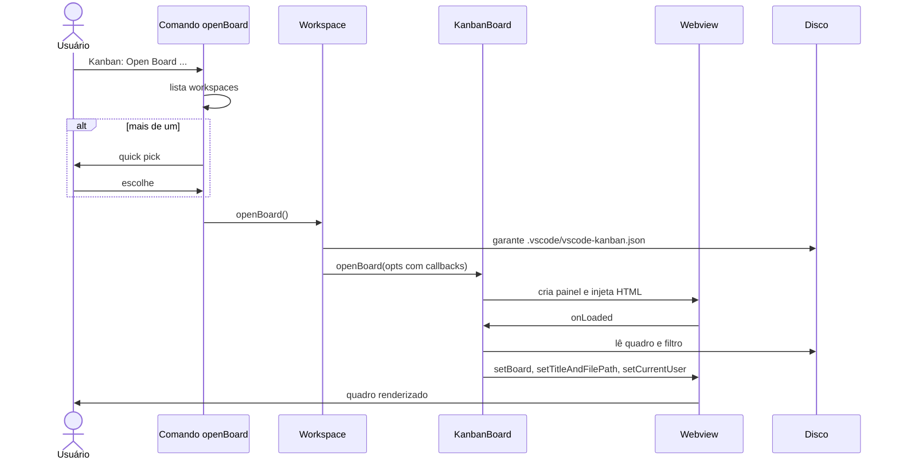
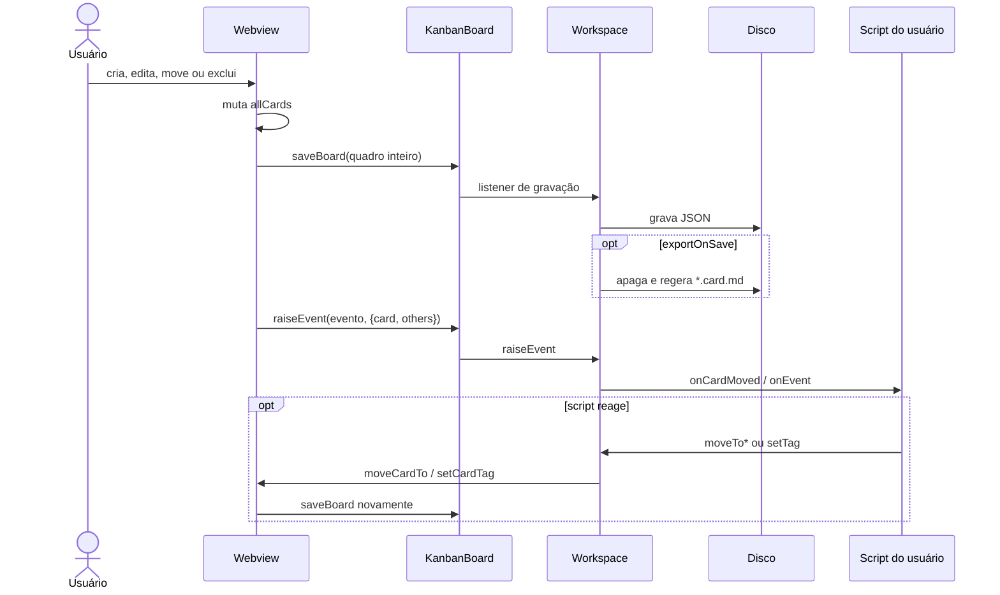

# Arquitetura — vscode-kanban

> Gerado pelo **Arquiteto** (Reversa) em 2026-08-02 · `doc_level: completo`
> Escala: 🟢 CONFIRMADO · 🟡 INFERIDO · 🔴 LACUNA
> Diagramas detalhados em `c4-context.md`, `c4-containers.md`, `c4-components.md` e
> `erd-complete.md`. Matriz de impacto em `traceability/spec-impact-matrix.md`.

---

## 1. Estilo arquitetural

**Extensão de editor com interface em Webview, sem servidor e sem banco** 🟢.

Formalmente, o sistema é um **cliente-cliente**: dois processos locais (extension host e
Webview) que trocam mensagens assíncronas, com o sistema de arquivos do workspace como camada
de persistência e uma única integração remota opcional (Toggl).

Não há camadas no sentido clássico. O que existe é uma separação **por processo**, e ela não
coincide com a separação por responsabilidade 🟢:

| Deveria estar em | Está em | Consequência |
|---|---|---|
| Domínio (regras do quadro) | `board.js`, no Webview | Sem tipos, sem módulos, sem testes |
| Aplicação (orquestração) | `workspaces.ts`, com 1.134 linhas | Regra de negócio misturada a I/O |
| Infraestrutura (disco, HTTP) | `workspaces.ts` e `toggl.ts` | Acoplamento direto a `fs-extra` e a `vscode-helpers` |
| Apresentação | `html.ts` + `boards.ts` (470 linhas de HTML literal) | Interface e modelo no mesmo arquivo |

Essa é a observação arquitetural central desta extração, iago, e ela decorre do **ADR-008**:
com o estado autoritativo no Webview, o domínio migrou para lá junto.

---

## 2. Visão de alto nível

---

## 3. Decisões estruturantes

Oito decisões governam o sistema; todas documentadas em `adrs/`. As quatro de maior alcance:

| ADR | Decisão | Efeito arquitetural |
|---|---|---|
| **008** | Estado autoritativo no Webview | O domínio vive fora do TypeScript; testabilidade nula |
| **001** | Quadro em JSON no workspace | Versionável, sem infraestrutura; sem controle de concorrência |
| **003** | Webview com bibliotecas vendorizadas | Zero *bundling*; nove dependências sem rastreio de versão |
| **004** | Script do workspace executado | Extensibilidade real; superfície de execução de terceiros |

---

## 4. Componentes e responsabilidades 🟢

| Componente | Responsabilidade | LOC | Coesão |
|---|---|---|---|
| `extension` | Ciclo de vida, logger, comando, utilitários | 586 | 🟡 Mista — logger, `open` e `saveToFile` são utilidades sem relação entre si |
| `workspaces` | Configuração, persistência, scripts, exportação, tempo | 1.134 | 🔴 Baixa — cinco responsabilidades num arquivo |
| `boards` | Modelo, painel e protocolo | 1.509 | 🔴 Baixa — modelo de dados junto de 470 linhas de HTML |
| `html` | Montagem do documento | 307 | 🟢 Alta — faz uma coisa |
| `toggl` | Cliente da API Toggl | 333 | 🟢 Alta |
| `announcements` | Aviso único | 102 | 🟢 Alta |
| `board-ui` | Estado, renderização, interação | 2.161 | 🔴 Baixa — o arquivo é o sistema inteiro |
| `webview-utils` | Filtro, Markdown, datas | 520 | 🟡 Média — utilitários variados, mas coerentes |

**Acoplamento** 🟢: há três ciclos de dependência entre módulos TypeScript
(`extension ⇄ workspaces`, `workspaces ⇄ boards ⇄ extension`, `toggl ⇄ workspaces`), resolvidos
em tempo de execução por *monkey patching* de `getAllWorkspaces` (`extension.ts:294`). O
sistema funciona, mas nenhum módulo pode ser carregado isoladamente.

---

## 5. Fluxos principais

### 5.1 Abertura do quadro

### 5.2 Alteração de cartão

🟡 O quadro é gravado **antes** de o script rodar, e um script que reaja provoca segunda
gravação. Não há transação nem ordem garantida entre a gravação e a exportação.

---

## 6. Integrações externas 🟢

| Integração | Direção | Protocolo | Autenticação | Situação |
|---|---|---|---|---|
| **API Toggl v8** | Saída | HTTPS/REST, JSON | Basic (`token:api_token` em base64) | 🟡 v8 descontinuada; v9 vigente |
| **Git local** | Entrada | `git config user.name` via processo | — | 🟢 Opcional (`noScmUser`) |
| **Sistema operacional** | Entrada | `OS.userInfo()` | — | 🟢 Opcional (`noSystemUser`) |
| **Navegador do SO** | Saída | `open` / `cmd start` / `xdg-open` | — | 🟢 Com confirmação para URLs externas |
| **Marketplace VS Code** | Saída (publicação) | `vsce` no CI | `VSCE_TOKEN` | 🟢 Só no *build* |

Endpoints Toggl consumidos: `GET /projects/{id}`, `GET /workspaces`,
`GET /workspaces/{id}/projects`, `GET /time_entries/current`, `POST /time_entries/start`,
`PUT /time_entries/{id}/stop`.

**Não há API produzida.** O sistema não expõe endpoint, webhook nem servidor — logo, não há
OpenAPI a gerar 🟢.

---

## 7. Persistência

Sem banco. Ver `erd-complete.md` para o modelo lógico e §13 do `data-dictionary.md` para os
caminhos. Resumo 🟢:

| Arquivo | Papel | Escopo |
|---|---|---|
| `.vscode/vscode-kanban.json` | Quadro completo | Workspace, versionável |
| `.vscode/vscode-kanban.filter` | Último filtro | Workspace |
| `.vscode/vscode-kanban.js` | Script de eventos | Workspace, **executável** |
| `<exportPath>/*.card.md` | Exportações | Workspace, derivado |
| `~/.vscode-kanban/.logs/*.log` | Log diário | Usuário |
| `globalState` do VS Code | Versão vista, aviso silenciado | Usuário |

---

## 8. Qualidades do sistema

| Atributo | Avaliação | Evidência |
|---|---|---|
| **Simplicidade de implantação** | 🟢 Excelente | Sem servidor, sem conta, sem configuração obrigatória |
| **Versionabilidade** | 🟢 Excelente | JSON indentado, *diff* legível, viaja com o repositório |
| **Extensibilidade** | 🟢 Boa | Sete eventos, `require` livre, estado por sessão e por workspace |
| **Desempenho** | 🟡 Adequado até certo porte | Quadro inteiro serializado a cada operação; `others` em cada evento |
| **Testabilidade** | 🔴 Muito baixa | Domínio no Webview; suíte com asserções de exemplo |
| **Segurança** | 🔴 Frágil | Execução de script sem confirmação; Webview sem CSP; `~` nas raízes de recurso |
| **Manutenibilidade** | 🔴 Baixa | Três arquivos acima de 1.000 linhas; ciclos de dependência; `strict: false` |
| **Observabilidade** | 🟡 Parcial | Log de arquivo existe, mas há dez blocos `catch` vazios |
| **Acessibilidade** | 🔴 Não avaliada | Sem atributos ARIA além dos herdados do Bootstrap |

---

## 9. Dívidas técnicas

### 9.1 Estruturais

| # | Dívida | Origem | Custo de correção |
|---|---|---|---|
| D1 | Domínio no Webview, sem tipos nem testes | ADR-008 | Alto — reescrita da camada |
| D2 | Três arquivos acima de 1.000 linhas (`board.js` 2.161, `boards.ts` 1.509, `workspaces.ts` 1.134) | Crescimento incremental | Médio |
| D3 | Ciclos de dependência resolvidos por *monkey patching* | ADR-008 + acoplamento | Médio |
| D4 | 470 linhas de HTML literal dentro de `boards.ts` | ADR-003 | Baixo — extrair para arquivos |
| D5 | `raiseEvent` com ~286 linhas e cinco responsabilidades | Crescimento por evento | Médio |
| D6 | `strict: false` no TypeScript; JS do Webview sem modo estrito | Configuração inicial | Médio — muitos erros surgirão |

### 9.2 De dependências

| # | Dívida | Severidade |
|---|---|---|
| D7 | Nove bibliotecas vendorizadas sem versão nem alerta de CVE | 🔴 Alta |
| D8 | Pacote `vscode` 1.1.37 deprecado; `postinstall` baixa binários e tende a falhar hoje | 🔴 Alta |
| D9 | TSLint descontinuado desde 2019 | 🟡 Média |
| D10 | Toolchain congelado em TypeScript 4.4 e Node 16, ambos fora de suporte | 🟡 Média |
| D11 | `moment` usado sem estar declarado no `package.json` | 🟡 Média |
| D12 | `marked` 4 com opções (`sanitize`, `mangle`) removidas nas versões seguintes | 🟡 Média |
| D13 | API Toggl v8 descontinuada | 🟡 Média |

### 9.3 De processo

| # | Dívida | Severidade |
|---|---|---|
| D14 | CI publica na Marketplace **sem rodar testes nem lint** | 🔴 Alta |
| D15 | Cobertura de domínio nula | 🔴 Alta |
| D16 | Script `build` usa `cp`/`mkdir` POSIX e quebra em Windows | 🟡 Média |
| D17 | TODO sem ação desde outubro de 2020 | 🟢 Baixa |
| D18 | Refatoração anunciada em 2020 e nunca realizada | 🟡 Média (sinaliza abandono) |

### 9.4 De segurança

Consolidadas em `permissions.md` §5. As cinco críticas: execução de script sem confirmação
(C1), `~` nas raízes de recurso (C2), ausência de CSP (C3), sanitização insuficiente de
Markdown (C4) e limpeza de exportações por glob (C5).

---

## 10. Riscos de evolução 🟡

| Risco | Probabilidade | Impacto | Mitigação sugerida |
|---|---|---|---|
| `npm install` falhar hoje por causa do pacote `vscode` deprecado | Alta | Bloqueante | Migrar para `@types/vscode` + `@vscode/test-electron` antes de qualquer coisa |
| Alterar `board.js` sem rede de testes introduzir regressão silenciosa | Alta | Alto | Escrever testes de caracterização antes de tocar no arquivo |
| Mudança no modelo do quadro invalidar arquivos existentes | Média | Alto | Versionar o esquema do JSON e migrar na carga |
| Atualizar `marked` quebrar a compilação | Alta | Baixo | Ajustar as opções junto da atualização |
| Restringir `activationEvents` quebrar `openOnStartup` | Baixa | Médio | `workspaceContains` cobre o caso |

---

## 11. Sequência recomendada de evolução 🟡

Ordem por relação entre risco reduzido e esforço, considerando que você opera como mantenedor
intermitente:

1. **Destravar o *build*** — migrar `vscode` → `@types/vscode` + `@vscode/test-electron`,
   declarar `moment`, atualizar TypeScript. Sem isso, nada mais é possível.
2. **Rede de segurança** — testes de caracterização sobre normalização de carga, ordenação,
   filtro e exportação. São funções puras e testáveis sem Webview, exceto pela localização.
3. **Guardrails no CI** — acrescentar lint e teste ao `publish.yml`, que hoje publica direto.
4. **Correções de segurança de baixo custo** — declarar `untrustedWorkspaces`, restringir
   `localResourceRoots`, acrescentar CSP, sanitizar o Markdown de verdade.
5. **`activationEvents`** — trocar `*` por `workspaceContains` mais `onCommand`.
6. **Extrair o domínio do Webview** — só depois dos passos anteriores, porque é a mudança de
   maior alcance e a que mais precisa de testes.
