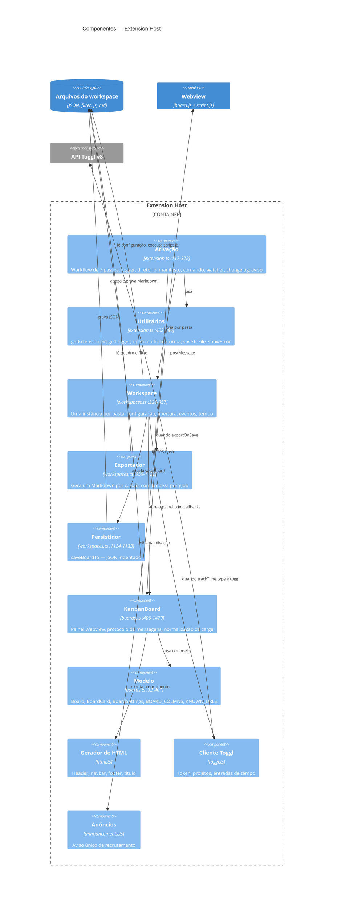
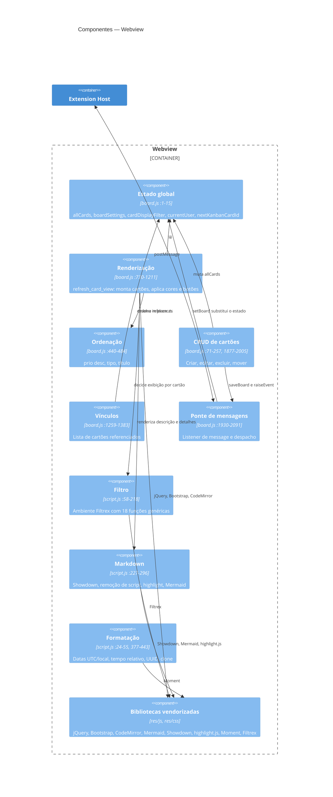

# C4 Nível 3 — Componentes

> Gerado pelo **Arquiteto** (Reversa) em 2026-08-02 · 🟢 CONFIRMADO salvo indicação
> Detalhados os dois containers relevantes: Extension Host e Webview.

---

## 1. Extension Host

### Responsabilidades

| Componente | Responsabilidade única? | Observação |
|---|---|---|
| Ativação | 🟡 | Sete passos heterogêneos, mas todos de inicialização |
| Utilitários | 🔴 | `open`, `saveToFile` e `getLogger` não têm relação entre si |
| `Workspace` | 🔴 | Cinco responsabilidades: configuração, abertura, eventos, tempo, coordenação |
| Exportador | 🟢 | Função pura de efeito único, embora com 163 linhas |
| Persistidor | 🟢 | Três linhas, faz uma coisa |
| `KanbanBoard` | 🔴 | Painel, protocolo, normalização e 470 linhas de HTML |
| Modelo | 🟢 | Só tipos e constantes |
| Gerador de HTML | 🟢 | Coeso |
| Cliente Toggl | 🟢 | Coeso, ainda que numa função de 265 linhas |
| Anúncios | 🟢 | Coeso |

### Candidatos naturais a extração 🟡

Se um dia você mexer nisto, iago, três extrações rendem muito com pouco risco:

1. **`Exportador`** já é quase autônomo: recebe `{board, dir, cleanup, maxNameLength}` e grava.
   Bastaria tirar a dependência de `vscode_helpers` para virar função pura testável.
2. **Normalização da carga** (`boards.ts:1336-1443`) é lógica pura de domínio presa dentro de
   um método privado com I/O. Separar entrada, normalização e saída daria o primeiro teste de
   domínio do projeto.
3. **HTML dos modais** (`boards.ts:449-919`) sai para arquivos `.html` sem tocar em lógica
   nenhuma, reduzindo `boards.ts` em quase um terço.

---

## 2. Webview

### Observação estrutural 🟢

Os "componentes" do Webview são **conceituais, não físicos**: não há módulos, `import`,
`export` nem namespace. As 33 funções de `board.js` e as 21 de `script.js` convivem no escopo
global do documento, distinguidas apenas pelo prefixo `vsckb_`.

Consequências diretas:

| Consequência | Detalhe |
|---|---|
| Sem fronteira verificável | Qualquer função alcança `allCards` diretamente |
| Sem teste unitário possível | Nada é importável fora de um navegador com jQuery carregado |
| Colisão silenciosa | `script.js:163` cria a global implícita `i` por falta de `let` |
| Ordem de carga importa | `script.js` precisa vir antes de `board.js` (`html.ts:139-140`) |

### Dependência entre os dois arquivos

`board.js` depende de 12 funções de `script.js` (`vsckb_does_match`, `vsckb_from_markdown`,
`vsckb_to_string`, `vsckb_normalize_str`, `vsckb_is_nil`, `vsckb_clone`, `vsckb_as_utc`,
`vsckb_as_local`, `vsckb_post`, `vsckb_raise_event`, `vsckb_uuid`, `vsckb_to_pretty_time`).
`script.js` **não** depende de `board.js` 🟢 — a dependência é unidirecional, o que torna
`script.js` o candidato mais fácil a virar módulo testável.
