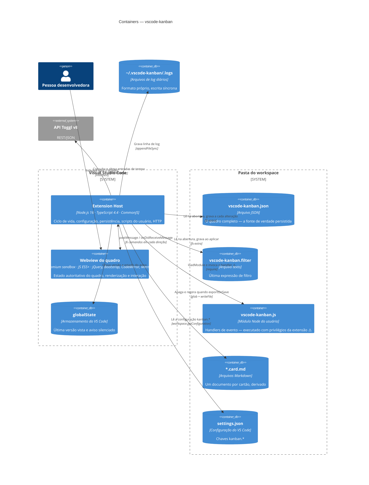

# C4 Nível 2 — Containers

> Gerado pelo **Arquiteto** (Reversa) em 2026-08-02 · 🟢 CONFIRMADO salvo indicação

---

## Containers

| Container | Tecnologia | Estado que guarda | Confiança |
|---|---|---|---|
| **Extension Host** | Node.js no processo do VS Code | Logger, `packageFile`, `workspaceWatcher`, instâncias `Workspace` (`_config`, `_STATE`) | 🟢 |
| **Webview do quadro** | `<iframe>` isolado do Chromium | `allCards`, `boardSettings`, `cardDisplayFilter`, `currentUser` — **o estado autoritativo** | 🟢 |
| **`vscode-kanban.json`** | Arquivo JSON indentado | O quadro persistido | 🟢 |
| **`vscode-kanban.filter`** | Arquivo texto | Expressão de filtro | 🟢 |
| **`vscode-kanban.js`** | Módulo CommonJS do usuário | Código executável ⚠️ | 🟢 |
| **`*.card.md`** | Markdown derivado | Nada — é saída, regerada a cada gravação | 🟢 |
| **`globalState`** | Armazenamento do editor, escopo de usuário | `vsckbLastKnownVersion`, chave do aviso | 🟢 |
| **Logs** | Arquivos diários em `~` | Histórico de eventos e erros | 🟢 |

## Protocolo entre os dois containers 🟢

| Extensão → Webview | Webview → Extensão |
|---|---|
| `setBoard` | `onLoaded` |
| `setTitleAndFilePath` | `saveBoard` |
| `setCurrentUser` | `saveFilter` |
| `moveCardTo` | `raiseEvent` |
| `setCardTag` | `reloadBoard` |
| `webviewIsVisible` | `openExternalUrl`, `openKnownUrl`, `log` |

Doze comandos ao todo, todos assíncronos e sem confirmação de entrega 🟢. `postMessage`
devolve uma promessa de booleano que o código verifica em `setTag` e `moveTo*`
(`workspaces.ts:840-849`), mas ignora nas demais chamadas.

## Observações arquiteturais

1. **O container que manda não é o que persiste** 🟢. O Webview detém o estado; o Extension
   Host detém o disco. Toda gravação é o Webview empurrando o quadro inteiro — decisão do
   ADR-008.
2. **O script do usuário é um container**, não uma biblioteca 🟢: código de terceiro, carregado
   em tempo de execução, com privilégios do host.
3. **Nenhum container de dados é validado na entrada** 🔴: `JSON.parse` sem esquema, sem
   `try/catch` e sem cópia de segurança.
4. **`retainContextWhenHidden: true`** mantém o Webview vivo em segundo plano, de modo que o
   estado pode divergir do disco por tempo indefinido 🟢.
