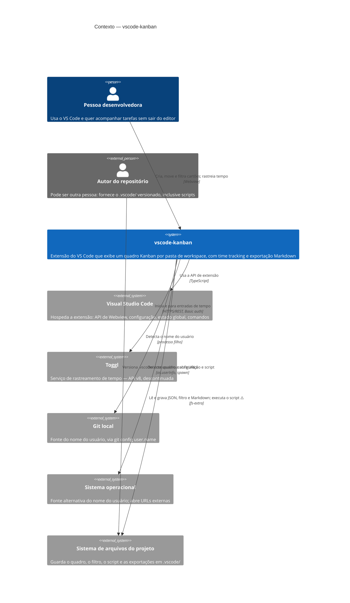

# C4 Nível 1 — Contexto

> Gerado pelo **Arquiteto** (Reversa) em 2026-08-02 · 🟢 CONFIRMADO salvo indicação

## Atores

| Ator | Natureza | Papel |
|---|---|---|
| **Pessoa desenvolvedora** | Humano | Usuário único do quadro; tem acesso total, sem autenticação |
| **Autor do repositório** | Humano, possivelmente terceiro | Fornece `.vscode/` versionado; **o script que ele escreve é executado na máquina de quem abre** ⚠️ |

A distinção entre os dois é a fronteira de confiança do sistema (ver `permissions.md` §5).

## Sistemas externos

| Sistema | Natureza da relação | Obrigatório? | Situação |
|---|---|---|---|
| **Visual Studio Code** | Hospedeiro | Sim | 🟢 Requer ≥ 1.62 |
| **Sistema de arquivos** | Persistência | Sim | 🟢 |
| **Git local** | Fonte de identidade | Não | 🟢 Desligável por `noScmUser` |
| **Sistema operacional** | Identidade e abertura de URLs | Não | 🟢 Desligável por `noSystemUser` |
| **Toggl** | Rastreamento de tempo | Não | 🟡 API v8 descontinuada |

## O que o sistema deliberadamente não tem 🟢

| Ausência | Consequência |
|---|---|
| Servidor próprio | Nenhuma infraestrutura, nenhum custo, nenhuma conta |
| Banco de dados | O arquivo JSON é o banco |
| Autenticação | Quem abre a pasta tem acesso total |
| Sincronização multiusuário | O Git é o mecanismo de compartilhamento |
| API pública | Nada a expor, nada a documentar em OpenAPI |
