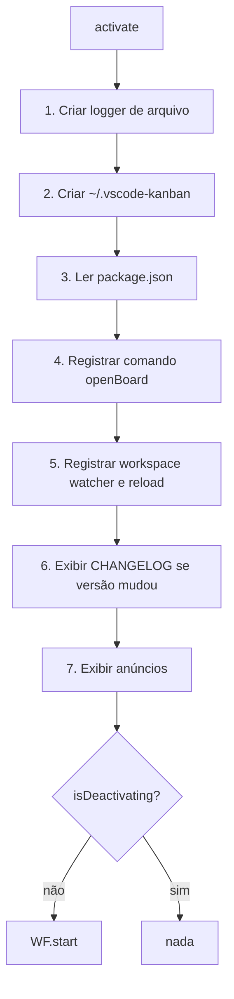
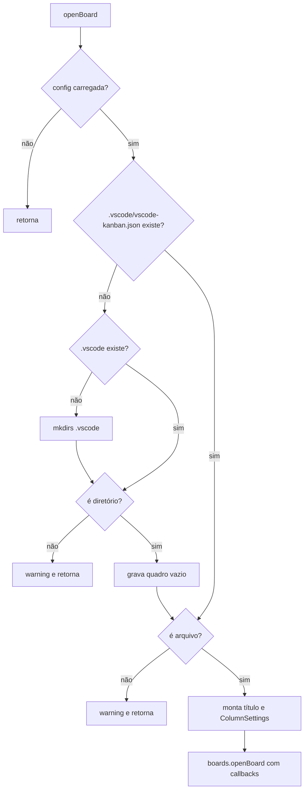
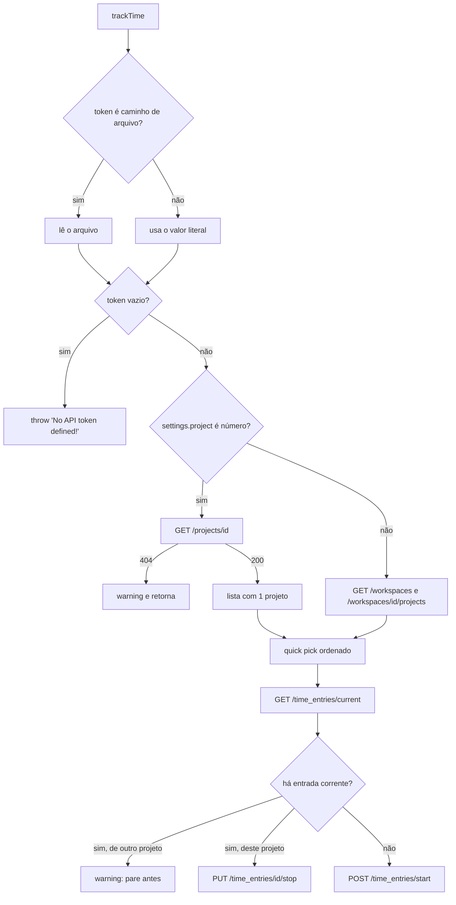
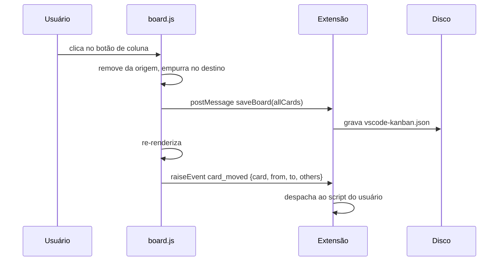

# Análise de Código — vscode-kanban

> Gerado pelo **Arqueólogo** (Reversa) em 2026-08-02 · `doc_level: completo`
> Escala: 🟢 CONFIRMADO (extraído do código) · 🟡 INFERIDO · 🔴 LACUNA

---

## Visão geral da arquitetura observada

O sistema tem duas metades que se comunicam **exclusivamente por troca de mensagens
assíncronas**, sem estado compartilhado:

```
┌─────────────────────────── Extension Host (Node.js) ────────────────────────────┐
│  extension.ts      ciclo de vida, logger, comando, utilitários                    │
│  workspaces.ts     1 Workspace por pasta; config, scripts, exportação, time track │
│  boards.ts         KanbanBoard: painel Webview + protocolo de mensagens           │
│  html.ts           montagem do documento HTML                                     │
│  toggl.ts          cliente HTTP da API Toggl v8                                   │
│  announcements.ts  aviso único de recrutamento                                    │
└────────────────────────────────┬────────────────────────────────────────────────┘
                                 │  postMessage / onDidReceiveMessage
┌────────────────────────────────┴────────────────────────────────────────────────┐
│                          Webview (Chromium sandbox)                              │
│  board.js          estado global do quadro, CRUD de cartões, render, drag&drop    │
│  script.js         utilitários: filtro Filtrex, Markdown, Mermaid, datas, UUID    │
└─────────────────────────────────────────────────────────────────────────────────┘
```

**Achado estrutural central** 🟢: o **estado autoritativo do quadro vive no Webview**, não na
extensão. A variável global `allCards` em `board.js:2` é a única cópia viva; a extensão lê o
JSON do disco, envia via `setBoard` e depois só recebe o quadro inteiro de volta no
`saveBoard`. Não há reconciliação nem detecção de conflito: quem salva por último vence.

---

## Módulo 1 — `extension` (`src/extension.ts`, 586 LOC)

**Propósito:** ativação e desativação da extensão, serviços transversais.

### Fluxo de controle 🟢

`activate()` monta um **workflow sequencial** (`vscode_helpers.buildWorkflow()`) de seis
passos, executados em ordem e só disparados se `isDeactivating` for falso:



### Funções principais

| Função | Assinatura | Papel | Confiança |
|---|---|---|---|
| `activate` | `(context: vscode.ExtensionContext) => Promise<void>` | Ponto de entrada | 🟢 |
| `deactivate` | `() => void` | Marca flag; **não libera recursos** | 🟢 |
| `getExtensionDir` | `() => string` | `~/.vscode-kanban` | 🟢 |
| `getLogger` | `() => vscode_helpers.Logger` | Logger global (singleton mutável de módulo) | 🟢 |
| `getWebViewResourceUris` | `() => vscode.Uri[]` | Raiz de recursos: `__dirname/res` | 🟢 |
| `open` | `(target, opts?) => Promise<ChildProcess>` | Abre URL/arquivo no SO | 🟢 |
| `saveToFile` | `(path, data) => Promise<void>` | Grava criando diretório | 🟢 |
| `showError` | `(err) => Promise<...>` | Loga em nível trace e mostra popup | 🟢 |

### Algoritmos não triviais

**1. Formato de log próprio** (`extension.ts:122-194`) 🟢 — formato inspirado no log do
Apache, gravado em `~/.vscode-kanban/.logs/YYYYMMDD.log`:

```
<TIPO> [<TAG>] - [DD/MMM/YYYY:HH:mm:ss +0000] "<mensagem>"
```

O tipo `Trace` acrescenta a pilha filtrada por linhas que começam com `at `. Escrita
**síncrona** (`appendFileSync`) dentro do callback do logger — cada log bloqueia o event loop
do extension host.

**2. Abertura multiplataforma** (`extension.ts:446-553`) 🟢 — implementação manual do
`open`, com três ramos:

| Plataforma | Comando | Detalhe |
|---|---|---|
| `darwin` | `open` | `-W` quando `wait`; `-a <app>`; `--args` no fim |
| `win32` | `cmd /c start ""` | escapa `&` para `^&`; `/wait` quando `wait` |
| demais | `xdg-open` ou o app dado | `stdio: 'ignore'` quando não espera |

**3. Exibição condicional do CHANGELOG** (`extension.ts:301-360`) 🟢 — compara
`packageFile.version` com `globalState['vsckbLastKnownVersion']`; se diferirem, renderiza
`CHANGELOG.md` com `marked` num Webview de escrita única e grava a versão nova.

### Regras de negócio embutidas

| Regra | Local | Confiança |
|---|---|---|
| Só workspaces com esquema de URI `''` ou `file` viram `Workspace` (URIs remotas são ignoradas) | `extension.ts:274` | 🟢 |
| Havendo um único workspace, o quick-pick é pulado e ele é aberto direto | `extension.ts:250-252` | 🟢 |
| Sem workspace, exibe "No workspace found!" e não abre nada | `extension.ts:241-247` | 🟢 |
| O CHANGELOG só aparece uma vez por versão | `extension.ts:311` | 🟢 |

### Achados

- 🟢 **`deactivate()` não descarta o `workspaceWatcher` nem os painéis.** Apenas marca
  `isDeactivating = true`. A limpeza depende de `context.subscriptions`, o que funciona no
  caso comum, mas o `logger` e o `packageFile` permanecem como estado global de módulo.
- 🟢 **Engolimento silencioso de erros:** os blocos `try { } catch { }` em `extension.ts:217`,
  `:351`, `:366` e `:433` descartam a exceção sem log. Uma falha ao ler o `package.json`, por
  exemplo, deixa `packageFile` indefinido e o CHANGELOG some sem qualquer sinal.
- 🟢 **Monkey patching de módulo:** `extension.ts:294` sobrescreve em tempo de execução
  `vsckb_workspaces.getAllWorkspaces`, uma variável exportada `let`. É o mecanismo que resolve
  a dependência circular `extension ⇄ workspaces`, ao custo de um contrato implícito: quem
  importar `getAllWorkspaces` antes da ativação recebe `undefined`.
- 🟡 **`marked` chamado com `sanitize: true` e `mangle: true`** (`extension.ts:333-339`) —
  opções removidas nas versões seguintes da biblioteca; a atualização exige mudança de código.

---

## Módulo 2 — `workspaces` (`src/workspaces.ts`, 1.134 LOC)

**Propósito:** representar uma pasta do workspace, com sua configuração, seu arquivo de
quadro, seus scripts de evento e sua exportação. É onde mora a maior parte das regras.

### Estruturas de dados

| Constante | Valor | Papel |
|---|---|---|
| `BOARD_FILENAME` | `vscode-kanban.json` | Quadro serializado |
| `FILTER_FILENAME` | `vscode-kanban.filter` | Último filtro |
| `SCRIPT_FILENAME` | `vscode-kanban.js` | Script de eventos do usuário |
| `BOARD_CARD_EXPORT_FILE_EXT` | `card.md` | Sufixo dos arquivos exportados |
| `EVENT_TRACK_TIME` | `track_time` | Nome do evento de rastreio |

Todos resolvidos sob `.vscode/` da pasta do workspace 🟢.

### Fluxo de abertura do quadro 🟢



**Título do quadro:** nome da pasta; se vazio, `Workspace #<index>` 🟢 (`workspaces.ts:471`).

### Algoritmo 1 — Despacho de eventos (`raiseEvent`, `workspaces.ts:600-886`) 🟢

O coração da extensibilidade. Sete eventos podem ser despachados para o script do usuário:
`card_created`, `card_deleted`, `card_moved`, `card_updated`, `column_cleared`,
`execute_card`, `track_time`.

Ordem de resolução do handler:

1. Se o evento é `track_time` **e** `canTrackTime`:
   - `trackTime` é objeto com `type` `''` ou `'script'` → guarda `options`, handler continua nulo (cai no script do usuário);
   - `type` `'toggl'` ou `'toggle'` → handler é `toggl.trackTime`, com `this` ligado ao Workspace;
   - `type` desconhecido → **retorna sem fazer nada** (`workspaces.ts:748`);
   - `trackTime` booleano verdadeiro → handler é o `trackTime` interno.
2. Se ainda não há handler, carrega `.vscode/vscode-kanban.js` via
   `vscode_helpers.loadModule` e escolhe a função pelo nome do evento.
3. Se o módulo não exporta a função específica, tenta o **fallback `onEvent`**
   (`workspaces.ts:805`).

O objeto de argumentos entregue ao script inclui `data`, `extension` (o `ExtensionContext`
completo), `file`, `globals` (clonado), `logger`, `name`, `options`, `require`, `session`,
`state`, além de `tag`/`uid` como *getters* e dos métodos `setTag`, `moveToDone`,
`moveToInProgress`, `moveToTesting`, `moveToTodo`.

- 🔴 **LACUNA de segurança (crítica):** o script do workspace roda com `require` irrestrito e
  acesso ao `ExtensionContext`, isto é, com todos os privilégios da extensão. Abrir um
  repositório de terceiros que contenha `.vscode/vscode-kanban.js` executa código arbitrário
  assim que qualquer evento de cartão dispara — e, com `openOnStartup`, sem nenhuma ação do
  usuário. Não há confirmação, sandbox nem allowlist. Registrado em `questions.md` (Q1).

### Algoritmo 2 — Time tracking interno (`trackTime`, `workspaces.ts:892-950`) 🟢

Modelo de **carimbos alternados**: cada acionamento acrescenta um instante UTC ISO ao array
`tag['time-tracking'].entries`. O total é recalculado a cada chamada, percorrendo o array e
somando a diferença de cada par (início, fim):

```
seconds = Σ (entries[2k+1] − entries[2k])
```

Sobrando um carimbo ímpar ao final (`lastStartTime` ainda é um `Moment`), o cronômetro está
**correndo** e a mensagem é "Time tracking has been started."; caso contrário, "STOPPED" com
a duração formatada por `humanize-duration`.

- 🟢 A soma é **recalculada do zero** a cada acionamento, de modo que corrigir manualmente o
  array `entries` no JSON corrige o total — propriedade útil e provavelmente não intencional.
- 🟡 Um array com número ímpar de entradas conta apenas os pares completos; o tempo desde o
  último início não entra no total até a parada. É consistente, mas o painel nunca mostra
  tempo "em andamento".

### Algoritmo 3 — Exportação Markdown (`exportBoardCardsTo`, `workspaces.ts:959-1122`) 🟢

Disparada em cada gravação quando `exportOnSave` está ligado.

1. **Resolução do destino:** `exportPath`; se vazio, `.vscode/`; se relativo, resolvido a
   partir de `.vscode/`.
2. **Limpeza (`cleanupExports`, padrão verdadeiro):** apaga por glob
   `vscode-kanban_*.card.md` no diretório — 🔴 **`FSExtra.unlink` sobre arquivos do usuário**.
   Apontar `exportPath` para uma pasta que contenha arquivos com esse prefixo os destrói sem
   confirmação.
3. **Nome do arquivo:** `vscode-kanban_{coluna}_{índice-na-coluna}_{título}`, saneado por
   `sanitize-filename` e truncado em `maxExportNameLength` (padrão 48; valores `NaN` ou < 1
   caem no 48).
4. **Colisão:** laço que acrescenta um sufixo **decrescente a partir de −1** (`0`, depois
   `-1`, `-2`, …) até encontrar nome livre — 🟢 comportamento peculiar mas funcional, porque
   `filenameSuffix` começa `NaN`, é zerado e depois decrementado.
5. **Conteúdo:** `# título`, seção `## Meta` com as chaves ordenadas alfabeticamente
   (`Column`, `Type`, `Category`, `Creation time`, `Assigned to`), seguida de `## Description`
   e `## Details` quando presentes, e rodapé de atribuição.

- 🟢 O tipo vazio é normalizado para `note` na exportação (`workspaces.ts:1055-1058`).
- 🟡 Título e metadados passam por `HtmlEntities.encode` **dentro de um arquivo Markdown**,
  de modo que um título com `&` sai como `&amp;` no `.md`. É escape na camada errada.

### Regras de negócio

| # | Regra | Local | Confiança |
|---|---|---|---|
| RN-01 | `canTrackTime` é verdadeiro sempre que `trackTime` não for nulo nem `false` | `workspaces.ts:356-362` | 🟢 |
| RN-02 | Recarregar a configuração durante um recarregamento reagenda a chamada em 1 s (debounce por reentrância) | `workspaces.ts:394-404` | 🟢 |
| RN-03 | `openOnStartup` abre o quadro a cada mudança de configuração, não só na ativação | `workspaces.ts:413`, `:590-598` | 🟢 |
| RN-04 | O filtro é lido do arquivo a cada abertura e gravado a cada aplicação | `workspaces.ts:502-512`, `:564-573` | 🟢 |
| RN-05 | Falha ao salvar o quadro não impede a exportação — os dois blocos têm `try/catch` independentes | `workspaces.ts:518-562` | 🟢 |
| RN-06 | `simpleIDs` tem padrão **verdadeiro** | `workspaces.ts:584` | 🟢 |

- 🟢 **RN-03 é um defeito latente:** `onDidChangeConfiguration` chama `openBoardOnStartup`, de
  modo que qualquer alteração em `settings.json` com `openOnStartup: true` tenta reabrir o
  quadro. `KanbanBoard.open()` devolve `false` se o painel já existir, o que evita a duplicata
  — mas apenas porque a instância anterior continua viva, o que não é garantido após um
  `dispose`.

---

## Módulo 3 — `boards` (`src/boards.ts`, 1.509 LOC)

**Propósito:** modelo do quadro e ponte com o Webview. Cerca de 470 linhas são HTML literal
dos modais.

### Modelo de dados 🟢

```
Board
 ├── todo         : BoardCard[]
 ├── in-progress  : BoardCard[]
 ├── testing      : BoardCard[]
 └── done         : BoardCard[]
```

`BOARD_COLMNS = ['todo', 'in-progress', 'testing', 'done']` (`boards.ts:388`) — grafia com o
erro de digitação original, preservada porque é a constante real. As quatro colunas são
**fixas**: não há mecanismo de coluna customizada, apenas renomeação de exibição.

### Protocolo de mensagens 🟢

**Webview → Extensão** (`boards.ts:1115-1262`):

| Comando | Dados | Efeito |
|---|---|---|
| `log` | `{message}` | `console.log` + logger em nível debug |
| `onLoaded` | — | Dispara `onLoaded()`: recarrega o quadro, envia título e usuário |
| `openExternalUrl` | `{url, text}` | **Pede confirmação** ao usuário antes de abrir |
| `openKnownUrl` | chave | Abre URL da tabela `KNOWN_URLS`, sem confirmação |
| `raiseEvent` | `{name, data}` | Encaminha ao `raiseEvent` do Workspace |
| `reloadBoard` | — | Relê o JSON do disco |
| `saveBoard` | `Board` | Notifica os listeners de gravação |
| `saveFilter` | string | Notifica os listeners de filtro |

**Extensão → Webview:** `setBoard`, `setTitleAndFilePath`, `setCurrentUser`, `moveCardTo`,
`setCardTag`, `webviewIsVisible`.

- 🟢 **Assimetria de segurança deliberada:** `openExternalUrl` exige confirmação
  ("Do you really want to open the URL …?"), mas `openKnownUrl` abre direto — aceitável,
  porque a lista `KNOWN_URLS` é fixa no código (GitHub, Twitter, PayPal, ajudas).

### Algoritmo — Normalização na carga (`reloadBoard`, `boards.ts:1336-1462`) 🟢

Executado a cada carga do arquivo:

1. `JSON.parse` do arquivo; se resultar nulo, usa `newBoard()`.
2. Clona o objeto.
3. Para cada coluna, força o valor a array (`asArray`) — tolera JSON com coluna ausente.
4. Para cada cartão **sem `id`**, gera um:
   - `simpleIDs` (padrão verdadeiro): `id = max(ids numéricos do quadro) + 1`;
   - caso contrário: `<YYYYMMDDHHmmss do creation_time>_<aleatório>_<uuid sem hífens>`.
5. Normaliza `description` e `details` de string para `{content, mime}`, aceitando apenas
   `text/markdown` e caindo em `text/plain` para qualquer outro MIME.
6. Carrega o filtro e envia tudo em `setBoard`.

- 🔴 **Defeito confirmado — geração de IDs simples é quadrática e sujeita a colisão.**
  `FIND_NEXT_SIMPLE_CARD_ID()` percorre todo o quadro a cada cartão sem ID, mas o resultado
  **não** considera os IDs recém-atribuídos no mesmo laço, porque a busca lê `loadedBoard` que
  já foi mutado — na prática funciona por efeito colateral da mutação em `C.id` antes da
  próxima iteração. A ordem de atribuição depende da ordem das colunas em `BOARD_COLMNS`.
  Registrado em `questions.md` (Q2).
- 🟢 **`JSON.parse` sem `try/catch`** (`boards.ts:1342`): um `vscode-kanban.json` corrompido
  rejeita a promessa e o erro sobe até `showError`, sem oferecer recuperação nem backup.

### Configuração do Webview 🟢

```js
{ enableCommandUris: true, enableFindWidget: true, enableScripts: true,
  retainContextWhenHidden: true, localResourceRoots: [...] }
```

- 🔴 **`localResourceRoots` inclui o diretório home inteiro do usuário**
  (`boards.ts:922-932`): `getWebViewResourceUris()` concatena `OS.homedir()` às raízes. Isso
  autoriza o Webview a carregar **qualquer arquivo sob `~`** como recurso. Somado a
  `enableCommandUris: true`, amplia consideravelmente a superfície de ataque de um quadro
  malicioso. Registrado em `questions.md` (Q3).
- 🟢 `getResourceUri` faz *fallback* silencioso: percorre as raízes e devolve a **última** URI
  testada quando nenhuma existe, em vez de indefinido.

---

## Módulo 4 — `html` (`src/html.ts`, 307 LOC)

**Propósito:** montar o documento HTML do Webview por concatenação de strings.

| Função | Papel | Confiança |
|---|---|---|
| `generateHeader` | `<head>` com 6 CSS e 10 scripts vendorizados, ponte `acquireVsCodeApi`, `window.onerror` | 🟢 |
| `generateNavBarHeader` | Barra fixa com marca, botões da tela e ícones sociais | 🟢 |
| `generateFooter` | Fecha o documento e carrega `js/<name>.js` e `css/<name>.css` | 🟢 |
| `generateHtmlDocument` | Compõe as três partes com o conteúdo | 🟢 |
| `getDocumentTitle` | `Kanban Board` ou `Kanban Board (<título>)` | 🟢 |

### Achados

- 🟢 **Convenção implícita por `name`:** `generateHtmlDocument({name: 'board'})` faz o rodapé
  carregar `js/board.js` e `css/board.css`. Um `name` inexistente gera tags quebradas
  silenciosamente. É acoplamento por convenção de nome, sem validação.
- 🟢 **Sem Content-Security-Policy.** Nenhum `<meta http-equiv="Content-Security-Policy">` é
  emitido, contrariando a recomendação oficial de Webviews do VS Code.
- 🟢 `crossorigin="anonymous"` em scripts locais (`html.ts:139-140`, `:183-184`) não tem
  efeito prático no esquema `vscode-resource`.
- 🟢 O escape via `HtmlEntities.encode` é aplicado corretamente ao título em `html.ts:221` e
  `:272`, e aos nomes de coluna em `boards.ts:457`, `:473`, `:489`, `:505`.

---

## Módulo 5 — `toggl` (`src/toggl.ts`, 333 LOC)

**Propósito:** iniciar e parar entradas de tempo na API Toggl v8.

### Fluxo 🟢



### Regras de negócio

| # | Regra | Local | Confiança |
|---|---|---|---|
| RN-07 | `token` pode ser o token literal ou o caminho de um arquivo; caminho relativo resolve a partir de `~` | `toggl.ts:71-92` | 🟢 |
| RN-08 | Autenticação Basic com `<token>:api_token` em base64 | `toggl.ts:101` | 🟢 |
| RN-09 | Com `project` configurado e existente, pula a varredura de workspaces | `toggl.ts:115-138` | 🟢 |
| RN-10 | Entrada corrente de outro projeto bloqueia o início: exige parada manual | `toggl.ts:217-224` | 🟢 |
| RN-11 | Tags da entrada: `vscode`, nome da pasta (duas vezes, via `basename`), coluna do cartão — normalizadas, deduplicadas e ordenadas | `toggl.ts:229-242` | 🟢 |
| RN-12 | Descrição da entrada é o título do cartão | `toggl.ts:236` | 🟢 |
| RN-13 | `created_with: 'vscode-kanban'` | `toggl.ts:244` | 🟢 |
| RN-14 | Ordenação do quick-pick: nome do projeto, depois nome do workspace | `toggl.ts:297-310` | 🟢 |
| RN-15 | Um único projeto dispensa o quick-pick | `toggl.ts:321-322` | 🟢 |

### Achados

- 🟡 **API v8 descontinuada.** Toda a integração aponta para `https://www.toggl.com/api/v8`,
  substituída pela v9 em `api.track.toggl.com`. É plausível que a funcionalidade esteja
  inteiramente quebrada hoje; não foi possível verificar sem credencial. `questions.md` (Q4).
- 🟢 **`new Buffer(...)` deprecado** (`toggl.ts:101`, também em `workspaces.ts:568`) — emite
  aviso de depreciação desde o Node 10 e é candidato a remoção.
- 🟢 **Token exposto em memória e potencialmente em log:** o token é lido em texto puro; um
  `THROW_HTTP_ERROR` inclui código e status, não o token — o vazamento direto não ocorre, mas
  o valor trafega pelo `settings.json` do workspace quando o usuário não usa a forma de
  arquivo.
- 🟢 `ME.folder.name` e `Path.basename(ME.folder.name)` produzem o mesmo valor na prática
  (`folder.name` já é um nome, não um caminho), gerando tag duplicada — inofensivo, pois o
  pipeline aplica `distinct()`.

---

## Módulo 6 — `announcements` (`src/announcements.ts`, 102 LOC)

**Propósito:** exibir um aviso único convidando à refatoração do projeto.

| Item | Valor | Confiança |
|---|---|---|
| Chave de estado | `vsckb_announcement_20201009_655f729b` | 🟢 |
| Valor de "não mostrar" | `'3'` | 🟢 |
| Opções | YES · No, but DONATE · Later · Don't show again | 🟢 |

Lógica 🟢: o aviso reaparece enquanto o valor gravado não for exatamente `'3'`. As opções
1 e 2 gravam o resultado de `openExternal` — ou seja, **abrir o link com sucesso equivale a
"não mostrar de novo"**; se o navegador falhar, o aviso volta. A opção 3 (`Later`) não grava
nada, por desenho.

- 🟢 Há um `//TODO: load from external resource` em `announcements.ts:31`, sem ação desde
  outubro de 2020 (data embutida na chave).
- 🟢 O aviso é de **2020** e convida a portar a extensão para React — sinal explícito de que a
  refatoração pretendida pelo autor nunca aconteceu.

---

## Módulo 7 — `board-ui` (`src/res/js/board.js`, 2.161 LOC)

**Propósito:** todo o comportamento do quadro dentro do Webview.

### Estado global 🟢

| Variável | Papel |
|---|---|
| `allCards` | O quadro inteiro — **fonte de verdade viva** |
| `boardSettings` | Configurações recebidas da extensão |
| `cardDisplayFilter` | Expressão de filtro corrente |
| `currentUser` | Usuário detectado (Git ou SO) |
| `nextKanbanCardId` | Contador de IDs de elementos DOM |
| `vsckb_update_card_interval` | Handle do temporizador de "tempo relativo" |

Nenhum módulo, nenhum encapsulamento: 33 funções e 6 variáveis no escopo global do documento.

### Taxonomia de cartões 🟢

Existem **dois vocabulários paralelos e divergentes** para o tipo do cartão:

| Contexto | Valores aceitos | Local |
|---|---|---|
| Seletor da interface | `bug`, `emergency`, `''` (Note / task) | `board.js:2099-2101` |
| Predicados do filtro | `is_bug` ← {`bug`, `issue`}; `is_note` ← {`''`, `note`, `task`}; `is_emergency` ← {`emergency`} | `board.js:807-809` |
| Cores | `bug` → fundo escuro; `emergency` → vermelho; demais → azul-informação com texto escuro | `board.js:368-380` |
| Ordenação | `emergency` = −2; `bug` = −1; demais = 0 | `board.js:452-462` |
| Exportação | tipo vazio vira `note` | `workspaces.ts:1055` |

- 🟢 `issue` e `task` são reconhecidos pelo filtro e pela exportação, mas **não existem no
  seletor** — só chegam ao quadro por edição manual do JSON ou por script.
- 🟢 As cores tratam `issue` e `task` como tipo genérico, ao contrário do filtro. A
  inconsistência é real e observável: um cartão `issue` é `is_bug` no filtro, mas não recebe a
  cor de bug.

### Algoritmo — Ordenação dos cartões (`vsckb_get_cards_sorted`, `board.js:464-484`) 🟢

Três critérios encadeados, aplicados dentro de cada coluna:

1. **Prioridade decrescente** (`prio`, com `NaN` → 0);
2. **Tipo crescente** pelo peso (`emergency` −2, `bug` −1, resto 0);
3. **Título** normalizado, em ordem alfabética.

Usa `Array.sort` **in place** sobre `allCards[type]`, de modo que a ordenação para exibição
**muda a ordem persistida** no arquivo — a ordem manual do usuário não sobrevive a um
recarregamento.

### Algoritmo — Identidade efêmera (`__uid`, `board.js:2013`) 🟢

Ao receber `setBoard`, cada cartão ganha:

```js
card['__uid'] = `${índice}-${Math.floor(Math.random() * 597923979)}-${Date.now()}`
```

Esse `__uid` é a identidade usada por `setCardTag`, `moveCardTo` e pelos scripts de evento.
É **regenerado a cada carga** e nunca persistido — a identidade estável é o `id`, o `__uid` é
apenas um identificador de sessão. Um script que guarde `__uid` entre sessões falha.

- 🟡 O número mágico `597923979` aparece aqui e em `boards.ts:1425`. Origem desconhecida;
  provavelmente arbitrário. `questions.md` (Q5).

### Fluxo de movimentação (`MOVE_CARD`, `board.js:1459-1477`) 🟢



- 🟢 **A gravação precede o evento.** O script de `card_moved` roda depois de o disco já ter
  sido escrito; um `moveTo*` dentro do handler dispara nova gravação. Não há transação.
- 🟢 Todo evento carrega `others` — **cópia de todos os demais cartões do quadro**
  (`vsckb_get_other_cards`). Em quadros grandes, cada evento serializa o quadro inteiro pela
  ponte de mensagens.

### Filtro de cartões

Delegado a `script.js` (módulo 8), com um contexto rico de valores e funções montado por
cartão em `board.js:836-927`.

---

## Módulo 8 — `webview-utils` (`src/res/js/script.js`, 520 LOC)

**Propósito:** utilitários compartilhados pelo Webview.

### Algoritmo — Linguagem de filtro (`vsckb_does_match`, `script.js:58-218`) 🟢

Constrói um ambiente e compila a expressão com **Filtrex** (`compileExpression`).

**Funções do ambiente:** `all`, `any`, `concat`, `contains`, `debug`, `float`, `int`,
`integer`, `is_empty`, `is_nan`, `is_nil`, `norm`, `normalize`, `number`, `regex`, `str`,
`str_invoke`, `unix` — mais, injetadas por cartão: `is_after`, `is_assigned_to`, `is_before`,
`is_cat`, `is_category`, `is_older`, `is_younger`.

**Valores por cartão:** `assigned_to`, `cat`, `category`, `description`, `details`, `id`,
`is_bug`, `is_emerg`, `is_emergency`, `is_issue`, `is_note`, `is_task`, `prio`, `priority`,
`tag`, `time`, `title`, `type`, `now`, `utc`, além dos literais `true`/`false`/`yes`/`no`/
`null`/`undefined`.

**Regra de falha** 🟢: qualquer erro de compilação ou execução é registrado no log e a função
**devolve `true`** (`script.js:213-217`), isto é, um filtro inválido mostra todos os cartões
em vez de nenhum. Escolha defensiva coerente, ainda que silenciosa para quem digitou errado.

- 🟢 **`str_invoke` permite invocar qualquer método de string por nome** (`script.js:159-176`),
  e `regex` compila padrão arbitrário — a linguagem de filtro é mais poderosa do que aparenta,
  ainda que confinada ao sandbox do Webview.
- 🟢 Bug real em `script.js:163`: `for (i = 2; ...)` sem `let`, criando **variável global
  implícita** `i`. Como o arquivo não está em modo estrito, passa silenciosamente.

### Demais utilitários 🟢

| Função | Papel | Observação |
|---|---|---|
| `vsckb_from_markdown` | Showdown → HTML | **Remove tags `<script>`** do resultado (`script.js:235`) |
| `vsckb_apply_mermaid` | Renderiza diagramas | Só em elementos marcados |
| `vsckb_apply_highlight` | highlight.js | — |
| `vsckb_to_pretty_time` | Tempo relativo | Usa `moment` |
| `vsckb_uuid` | Gera UUID | v4 baseado em `Math.random` |
| `vsckb_post` | Ponte para a extensão | `vscode.postMessage` |
| `vsckb_raise_event` | Atalho para `raiseEvent` | — |

- 🟢 A remoção de `<script>` após a conversão de Markdown é a **única barreira de sanitização**
  do conteúdo do cartão. Atributos de evento (`onerror`, `onclick`) e `<iframe>` passam
  intactos, e o Showdown não sanitiza por padrão. Com `enableScripts: true` e sem CSP, um
  cartão com `` executa script no Webview. Registrado em
  `questions.md` (Q6).

---

## Síntese dos achados por severidade

### 🔴 Críticos (segurança)

| # | Achado | Local |
|---|---|---|
| C1 | Execução de código arbitrário via `.vscode/vscode-kanban.js`, com `require` e `ExtensionContext` completos, sem confirmação | `workspaces.ts:769` |
| C2 | `localResourceRoots` inclui todo o diretório home do usuário | `boards.ts:922-932` |
| C3 | Sem CSP, com `enableScripts` e `enableCommandUris` ligados | `html.ts:160-226`, `boards.ts:1106-1112` |
| C4 | Sanitização de Markdown limitada à remoção de `<script>`; atributos de evento passam | `script.js:235` |
| C5 | `cleanupExports` apaga por glob arquivos do diretório de exportação escolhido pelo usuário | `workspaces.ts:970-986` |

### 🟡 Estruturais

| # | Achado | Local |
|---|---|---|
| E1 | Estado autoritativo no Webview, sem reconciliação: última gravação vence | `board.js:2`, `boards.ts:1217` |
| E2 | Dependências circulares resolvidas por monkey patching | `extension.ts:294` |
| E3 | Ordenação in place altera a ordem persistida | `board.js:465` |
| E4 | `JSON.parse` do quadro sem tratamento de erro nem backup | `boards.ts:1342` |
| E5 | Dois vocabulários divergentes de tipo de cartão | `board.js:807-809` vs `:2099-2101` |
| E6 | Eventos carregam cópia integral dos demais cartões | `board.js:1473` |
| E7 | `strict: false`, sem modo estrito no JS do Webview, escopo global | `tsconfig.json`, `board.js` |
| E8 | Escrita síncrona de log no event loop | `extension.ts:193` |

---

## Métricas

| Métrica | Valor | Limite do usuário | Situação |
|---|---|---|---|
| Maior arquivo | `board.js`, 2.161 linhas | 400 | ✗ excede 5,4× |
| Segundo maior | `boards.ts`, 1.509 linhas | 400 | ✗ excede 3,8× |
| Terceiro | `workspaces.ts`, 1.134 linhas | 400 | ✗ excede 2,8× |
| Maior função | `raiseEvent`, ~286 linhas | 50 | ✗ excede 5,7× |
| Segunda | `exportBoardCardsTo`, ~163 linhas | 50 | ✗ |
| Cobertura de testes no domínio | ≈ 0% | ≥ 60% | ✗ |
| TODO/FIXME sem ação | 1 (desde 2020) | 30 dias | ✗ |

Todos os sinais de dívida técnica do seu Princípio 5.6 estão disparados neste código, iago.
Isso não desqualifica a extensão — ela funciona e teve 86 commits ao longo de quatro anos —
mas define o ponto de partida honesto para qualquer evolução.
