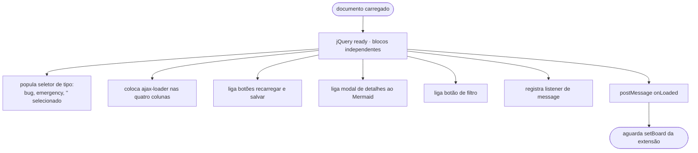
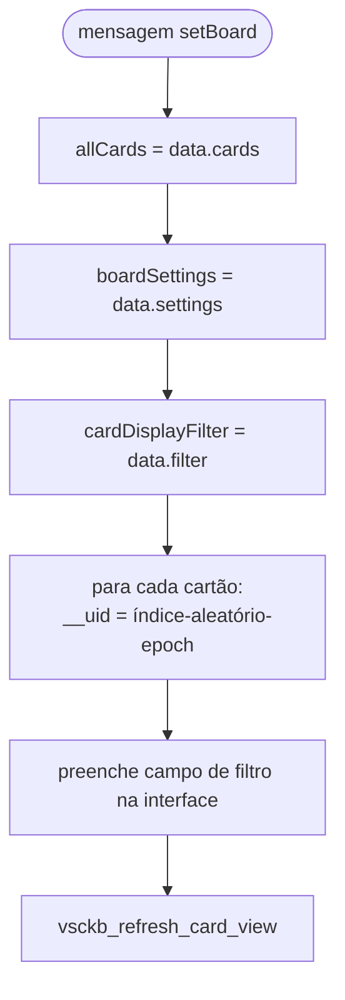
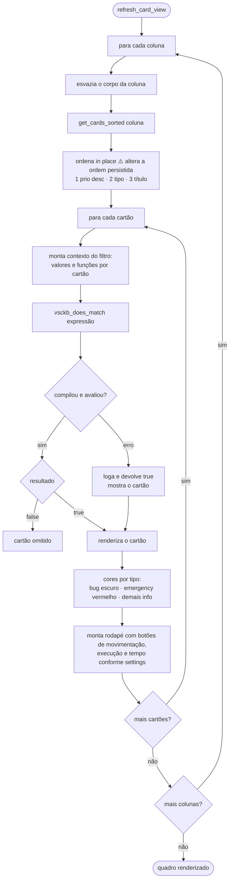
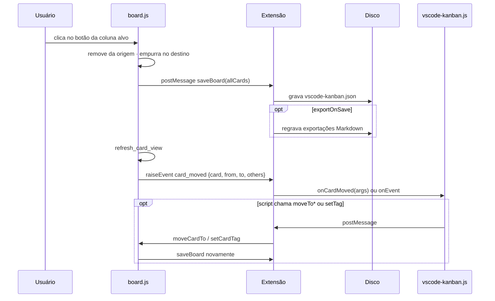
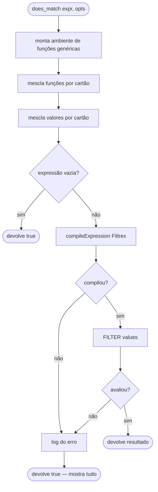
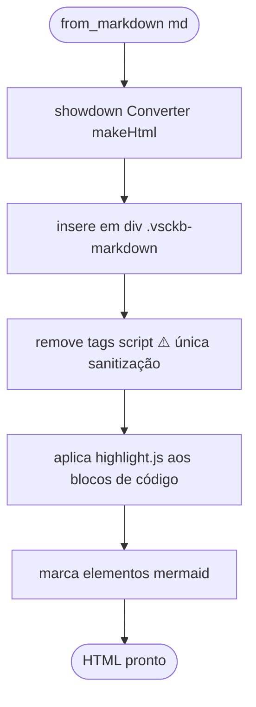

# Fluxogramas — módulos do Webview (`board-ui` e `webview-utils`)

> `src/res/js/board.js` (2.161 LOC) e `src/res/js/script.js` (520 LOC)
> 🟢 CONFIRMADO salvo indicação

## Inicialização do Webview

## Recepção de `setBoard`

## Renderização e filtragem

## Movimentação de cartão

🟢 A gravação **precede** o evento; não há transação. Um script que mova o cartão dispara uma
segunda gravação.

## Avaliação do filtro (`vsckb_does_match`)

## Renderização de Markdown

🔴 Atributos de evento (`onerror`, `onclick`) e elementos como `<iframe>` **não** são
removidos. Com `enableScripts: true` e sem CSP, conteúdo de cartão consegue executar script no
contexto do Webview.
