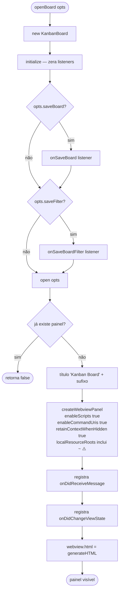
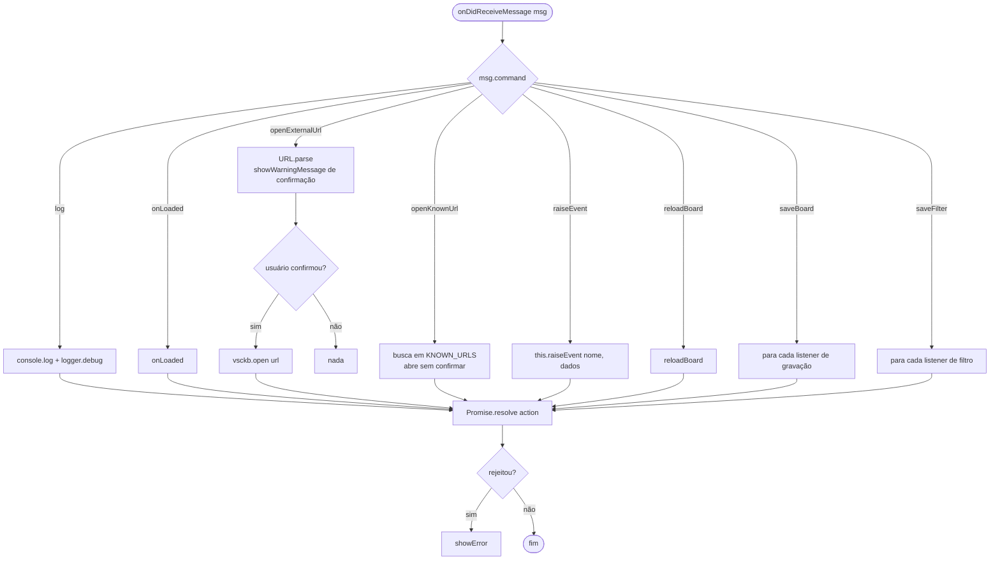
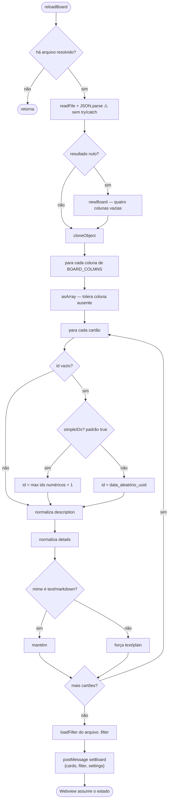
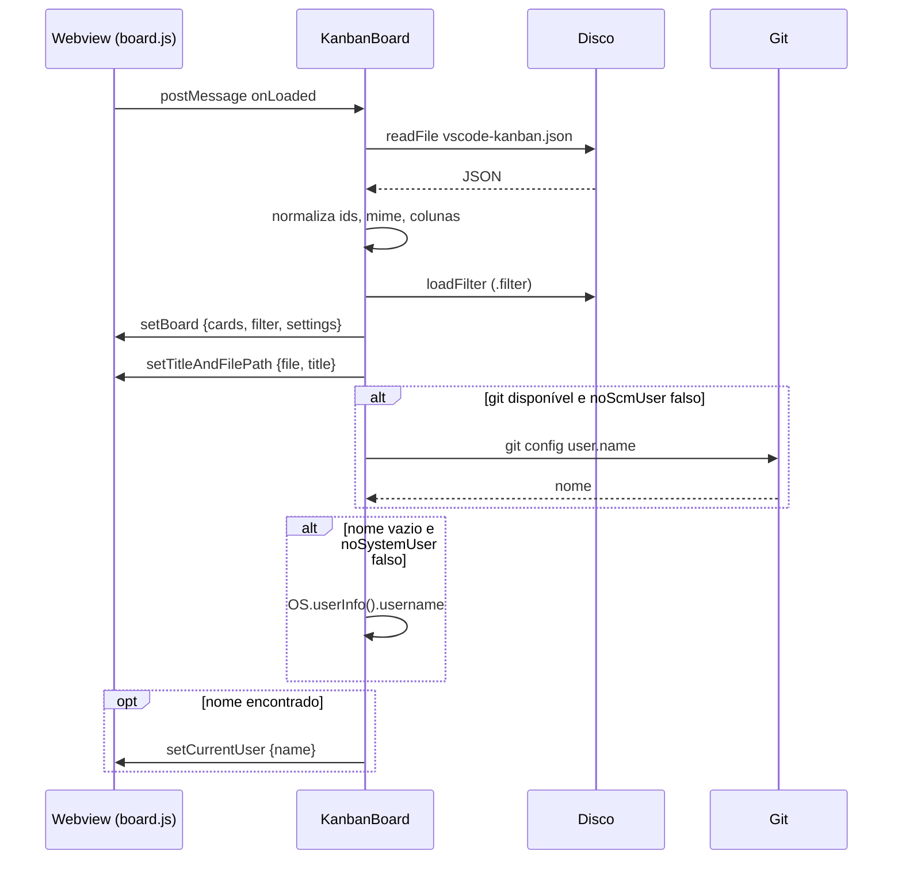
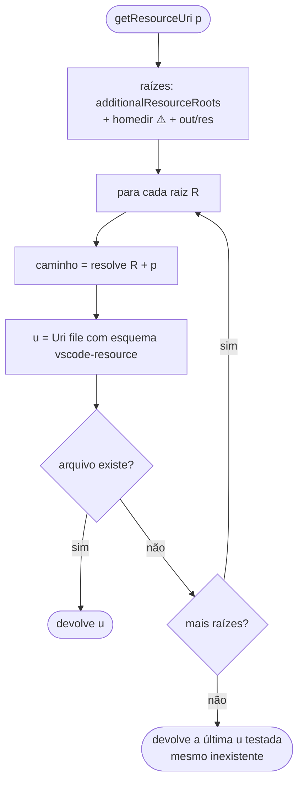

# Fluxogramas — módulo `boards`

> `src/boards.ts` · 1.509 LOC · 🟢 CONFIRMADO salvo indicação

## Abertura do painel

## Recepção de mensagens do Webview

## Carga e normalização do quadro

## Handshake de carregamento

## Resolução de URI de recurso

