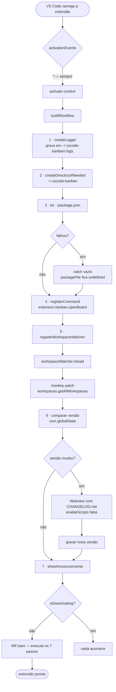
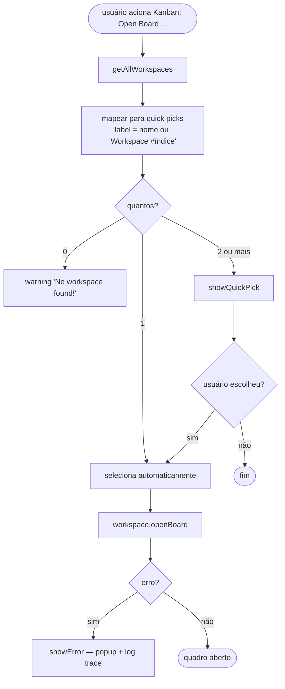
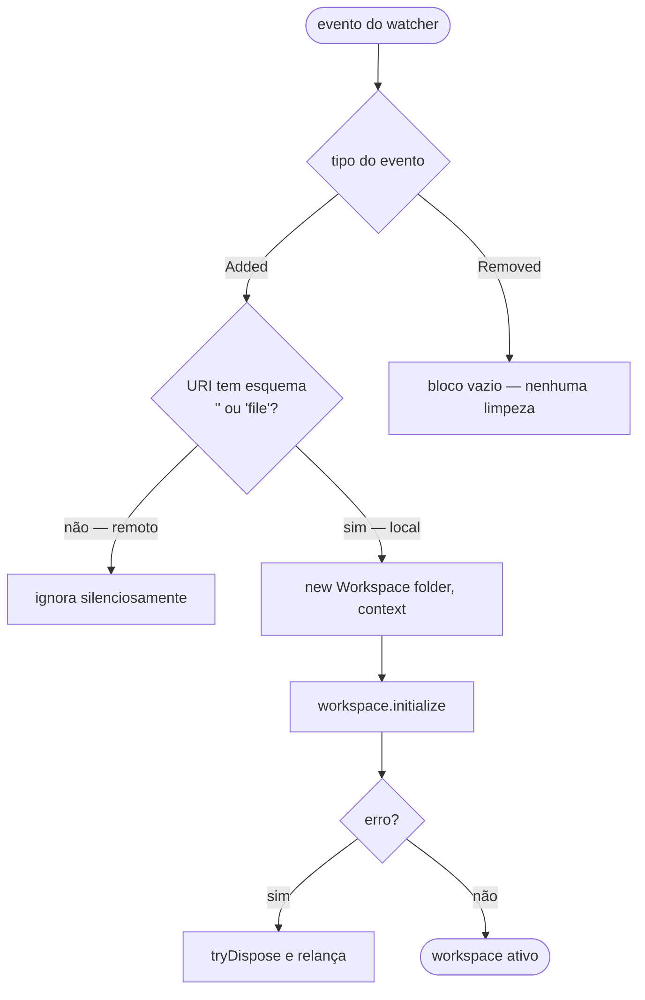
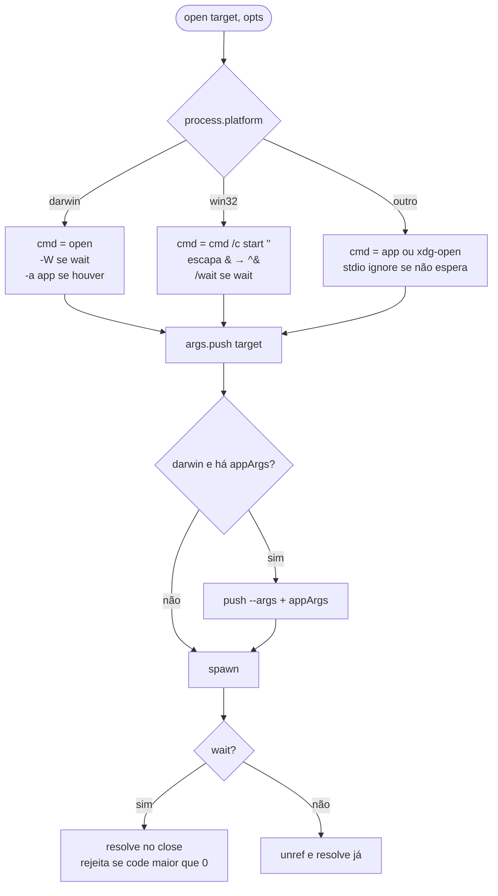

# Fluxogramas — módulo `extension`

> `src/extension.ts` · 586 LOC · 🟢 CONFIRMADO salvo indicação

## Ativação

## Comando `openBoard`

## Registro de workspace

🟢 O ramo `Removed` está vazio no código (`extension.ts:287-288`): a remoção de uma pasta do
workspace não dispara descarte explícito da instância.

## Abertura de alvo externo (`open`)

