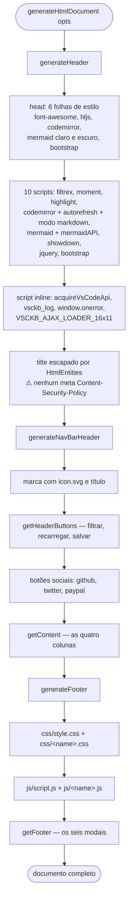
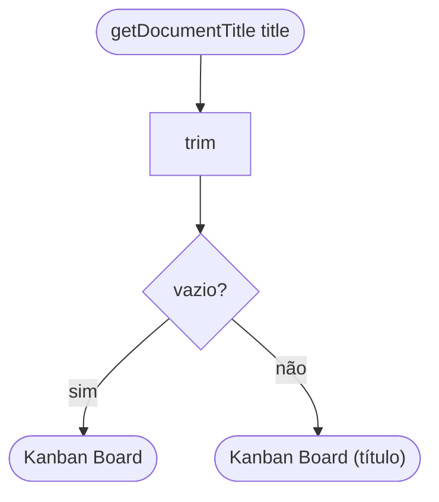
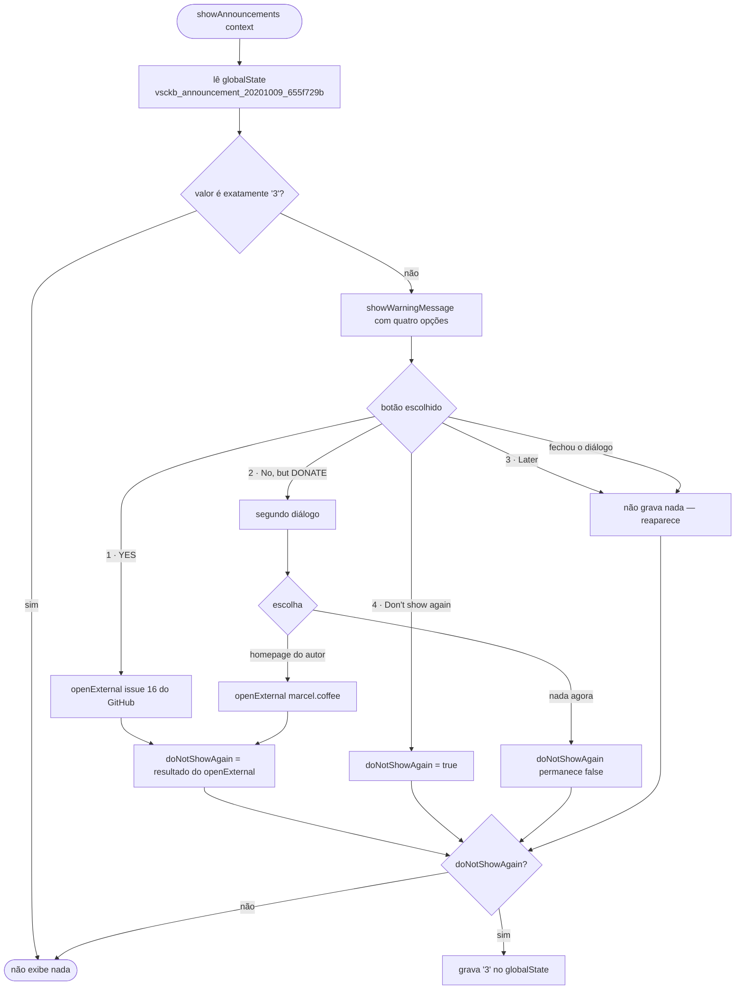

# Fluxogramas — módulos `html` e `announcements`

> `src/html.ts` (307 LOC) e `src/announcements.ts` (102 LOC) · 🟢 CONFIRMADO

## Composição do documento (`html`)

🟢 O parâmetro `name` (valor `board`) determina por convenção quais arquivos de estilo e
script são carregados. Não há validação de existência.

## Título do documento

## Aviso único (`announcements`)

🟢 Consequência da linha `doNotShowAgain = await openExternal(...)`: **abrir o link com
sucesso silencia o aviso**; falha ao abrir o navegador faz o aviso reaparecer na próxima
ativação.
