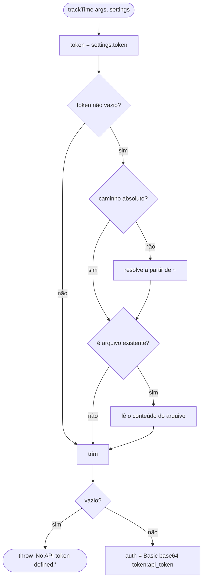
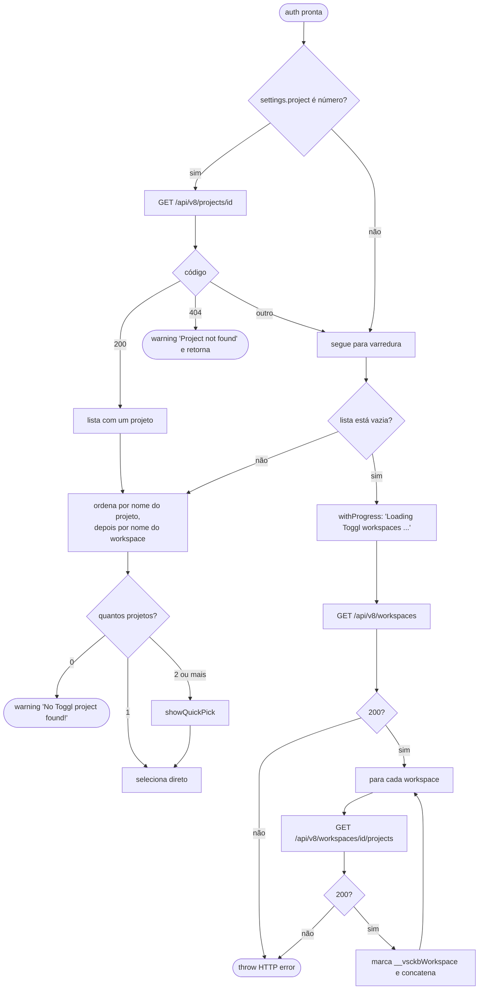
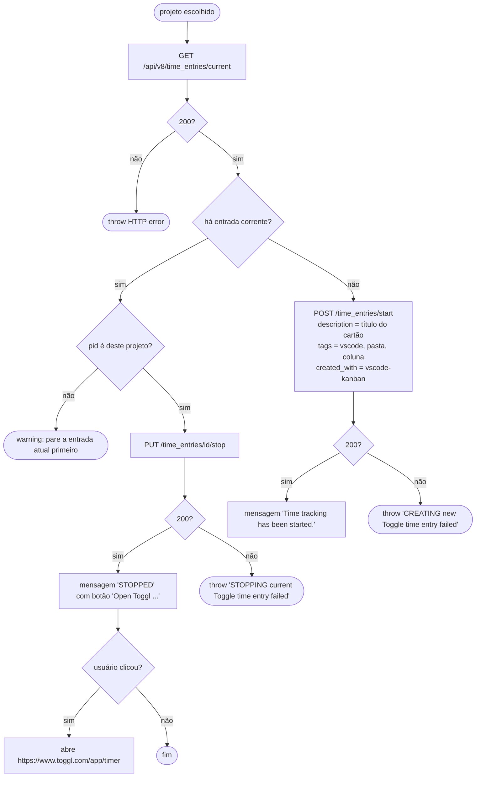

# Fluxogramas — módulo `toggl`

> `src/toggl.ts` · 333 LOC · 🟢 CONFIRMADO salvo indicação
> ⚠️ Toda a integração aponta para a API v8, descontinuada pelo fornecedor.

## Resolução do token

## Descoberta de projetos

## Início e parada da entrada de tempo

