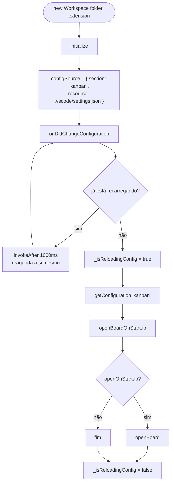
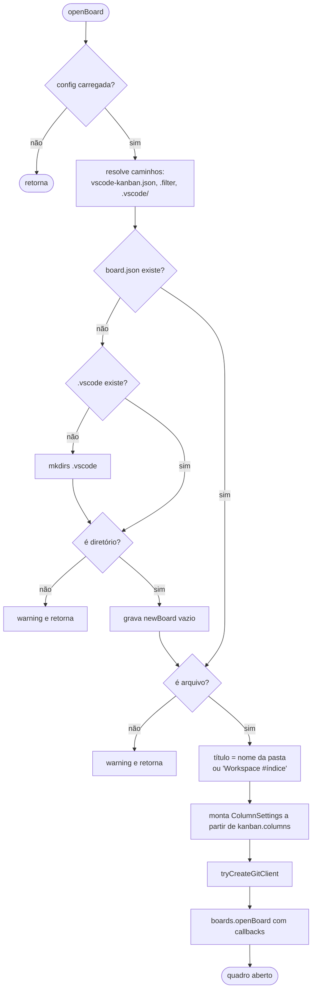
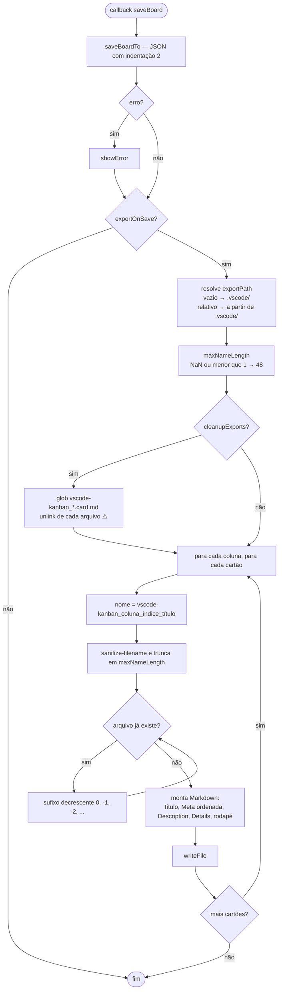
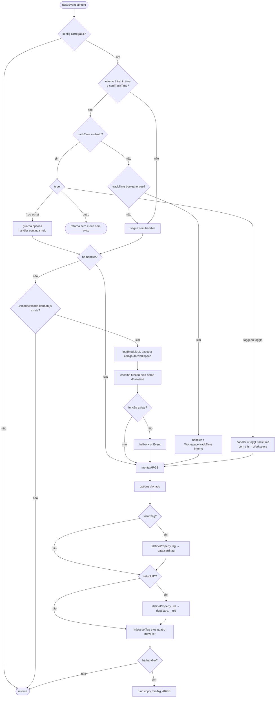

# Fluxogramas — módulo `workspaces`

> `src/workspaces.ts` · 1.134 LOC · 🟢 CONFIRMADO salvo indicação

## Ciclo de vida do `Workspace`



🟡 `openBoardOnStartup` roda a **cada** mudança de configuração, não apenas na ativação.

## Abertura do quadro



## Gravação e exportação



## Despacho de eventos (`raiseEvent`)



## Time tracking interno

```mermaid
flowchart TD
    A([trackTime args]) --> B{args.tag existe?}
    B -->|não| C[tag = objeto vazio]
    B -->|sim| D
    C --> D{tag['time-tracking'] existe?}
    D -->|não| E["inicializa { seconds: 0, entries: [] }"]
    D -->|sim| F
    E --> F[push do instante UTC atual em entries]
    F --> G[percorre entries em pares]
    G --> H["seconds = Σ entries ímpar menos entries par"]
    H --> I[grava total em tag time-tracking seconds]
    I --> J[await args.setTag tag]
    J --> K{sobrou carimbo ímpar?}
    K -->|sim| L[mensagem: tracking iniciado]
    K -->|não| M[mensagem: tracking PARADO + duração humanizada]
```
