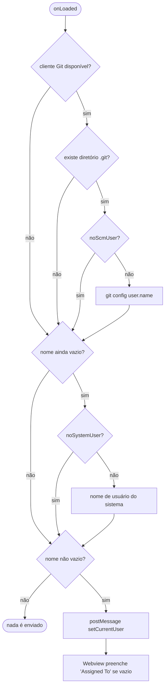

# Identificação de Usuário — Design Técnico

> Unit da extração Reversa · 2026-08-02

## Interface

| Símbolo | Assinatura | Retorno | Observação |
|---|---|---|---|
| `Workspace.tryCreateGitClient` | `()` | `Promise<any>` | Delegado a `vscode-helpers` |
| `KanbanBoard.onLoaded` | `()` | `Promise<void>` | Onde a detecção ocorre |
| mensagem `setCurrentUser` | `{name: string}` | — | Extensão → Webview |
| `vsckb_setup_assigned_to` | `(field, user)` | `void` | Preenche o campo |
| `vsckb_get_user_list` | `()` | `string[]` | Nomes já usados no quadro |

## Fluxo Principal

Detalhes 🟢:

1. `tryCreateGitClient` é chamado na montagem das opções de abertura
   (`workspaces.ts:501`, `:952-956`).
2. Em `onLoaded`, verifica-se a existência de `<cwd>/.git` antes de qualquer consulta
   (`boards.ts:1000-1004`).
3. `git config user.name` é executado **sincronamente** por `execSync` do cliente
   (`boards.ts:1010-1012`).
4. Não havendo nome, tenta-se `OS.userInfo().username` (`boards.ts:1023-1025`).
5. Havendo nome, envia-se `setCurrentUser` (`boards.ts:1029-1033`).
6. O Webview guarda em `currentUser` e preenche o campo de responsável apenas se estiver vazio
   (`board.js:2047-2058`).

## Fluxos Alternativos

- **Sem cliente Git:** salta direto para a fonte do sistema 🟢.
- **Sem diretório `.git`:** o Git não é consultado, mesmo com cliente disponível 🟢.
- **`execSync` falhando:** `try/catch` vazio; o nome fica vazio (`boards.ts:1009-1013`) 🟢.
- **`OS.userInfo()` falhando:** `try/catch` vazio (`boards.ts:1023-1025`) 🟢.
- **Nome vazio ao final:** nenhuma mensagem é enviada, e o campo permanece vazio 🟢.
- **Campo já preenchido no Webview:** o valor detectado é ignorado (`board.js:2052`) 🟢.

## Dependências

- `abertura-do-quadro` — a detecção acontece dentro do handshake
- `gestao-de-cartoes` — o campo preenchido pertence ao modal de criação
- `configuracao-do-workspace` — `noScmUser` e `noSystemUser`
- `vscode-helpers` — `tryCreateGitClient`
- Node `os` — `userInfo`

## Decisões de Design Identificadas

| Decisão | Evidência | Confiança |
|---|---|---|
| Cascata Git → sistema operacional, nessa ordem | `boards.ts:998-1027` | 🟢 |
| Verificação de `.git` antes de consultar o Git | `boards.ts:1000-1004` | 🟢 |
| Duas chaves de desligamento independentes | `package.json:89-98` | 🟢 |
| Falha totalmente silenciosa em ambas as fontes | `boards.ts:1009-1013`, `:1023-1025` | 🟢 |
| Detecção uma única vez, no carregamento | `boards.ts:983-1034` | 🟢 |
| Preenchimento só quando o campo está vazio | `board.js:2052` | 🟢 |

## Estado Interno

| Estado | Onde | Ciclo de vida |
|---|---|---|
| `currentUser` | global do Webview | Da carga ao fechamento do painel |

Nada é persistido: o nome vive apenas em memória e no valor gravado nos cartões que o usuário
criar 🟢.

## Observabilidade

🔴 Nenhuma. Ambas as consultas falham em silêncio, e não há registro de qual fonte forneceu o
nome — se o campo vier vazio, não há como diagnosticar por quê.

## Riscos e Lacunas

- 🟢 **Execução síncrona no handshake**: `execSync` bloqueia o *event loop* do extension host
  durante a consulta ao Git, ainda que por pouco tempo
- 🟡 **Privacidade**: o nome detectado acaba gravado no arquivo do quadro, que costuma ser
  versionado e compartilhado. As chaves de desligamento existem, mas o comportamento padrão é
  detectar
- 🔴 Falha silenciosa em ambas as fontes torna o diagnóstico impossível
- 🟢 A detecção ocorre uma única vez: trocar de configuração de Git com o quadro aberto não
  atualiza o nome
- 🟡 `vsckb_get_user_list` (`board.js:548-586`) coleta os nomes já usados no quadro para
  sugestão, mecanismo independente desta detecção e não documentado
