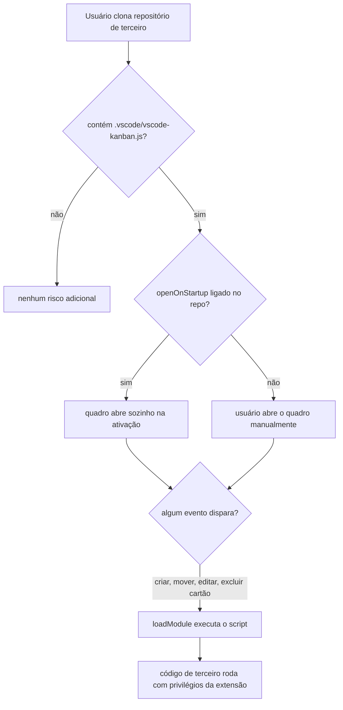
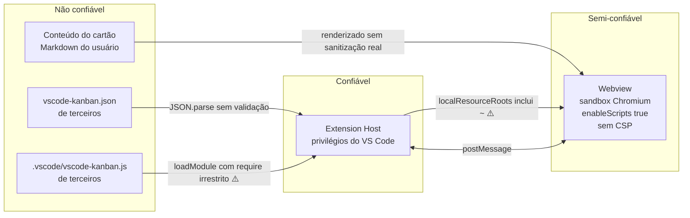

# Permissões e Papéis — vscode-kanban

> Gerado pelo **Detetive** (Reversa) em 2026-08-02
> Escala: 🟢 CONFIRMADO · 🟡 INFERIDO · 🔴 LACUNA

---

## Veredito

**Não existe controle de acesso neste sistema** 🟢. Nenhum papel, nenhuma autenticação,
nenhuma verificação de permissão. Toda busca por `role`, `permission`, `auth`, `can*` no
código só encontra `canExecute` e `canTrackTime` — que são **flags de configuração**, não
permissões de usuário.

Isso é coerente com o desenho: é uma extensão local de editor, monousuário, sem servidor. Quem
tem acesso ao arquivo tem acesso total. A seção existe para registrar a ausência de forma
explícita, e para mapear o que **de fato** governa o acesso a cada capacidade.

---

## 1. Atores

| Ator | Natureza | Como age sobre o sistema | Confiança |
|---|---|---|---|
| **Usuário do editor** | Humano | Interface do Webview, comando `openBoard`, edição direta dos arquivos | 🟢 |
| **Script do workspace** | Código local (`.vscode/vscode-kanban.js`) | Recebe eventos, move cartões, grava `tag`, faz `require` arbitrário | 🟢 |
| **Autor do repositório** | Humano, possivelmente terceiro | Fornece o `.vscode/` versionado — inclusive o script | 🟢 |
| **API Toggl** | Serviço externo | Recebe e devolve entradas de tempo, autenticada por token | 🟢 |

O terceiro ator é o que importa para a segurança: **quem escreveu o repositório não é
necessariamente quem o abriu**.

---

## 2. O que efetivamente governa cada capacidade

Não sendo identidade, o governo é por **configuração** e por **presença de arquivo**:

| Capacidade | Governada por | Padrão | Escopo |
|---|---|---|---|
| Abrir o quadro | — (sempre disponível) | — | comando |
| Criar, editar, mover, excluir cartão | — (sempre disponível) | — | Webview |
| Limpar a coluna Done em massa | — (sempre disponível, com confirmação) | — | Webview |
| Filtrar cartões | — (sempre disponível) | — | Webview |
| Ver botão de execução no cartão | `kanban.canExecute` | `false` | workspace |
| Ver botão de tempo | `kanban.trackTime` diferente de nulo e de `false` | `false` | workspace |
| Ocultar botão de tempo em Todo e Done | `kanban.noTimeTrackingIfIdle` | `false` | workspace |
| Exportar cartões em Markdown | `kanban.exportOnSave` | `false` | workspace |
| Apagar exportações anteriores | `kanban.cleanupExports` | **`true`** | workspace |
| Abrir o quadro na inicialização | `kanban.openOnStartup` | `false` | workspace |
| Detectar usuário via Git | `kanban.noScmUser` (negativa) | detecta | workspace |
| Detectar usuário do sistema | `kanban.noSystemUser` (negativa) | detecta | workspace |
| **Executar código do workspace** | **presença de `.vscode/vscode-kanban.js`** | executa se existir | workspace |
| Rastrear tempo no Toggl | `kanban.trackTime.type` = `toggl` e token válido | desligado | workspace |

🟢 **Assimetria de padrão relevante:** todas as capacidades que gastam recurso ou tocam o
disco vêm **desligadas** por padrão, com uma exceção — `cleanupExports` vem **ligada**. Ou
seja, quem liga `exportOnSave` liga junto, sem saber, a exclusão de arquivos por glob.

---

## 3. Matriz de capacidades do script do usuário 🟢

O script é o ator com mais poder do sistema. O que ele pode:

| Capacidade | Como | Restrição |
|---|---|---|
| Ler dados do cartão do evento | `args.data.card` | nenhuma |
| Ler **todos** os demais cartões | `args.data.others` | nenhuma |
| Gravar dados arbitrários no cartão | `args.setTag(tag, card?)` | nenhuma |
| Mover qualquer cartão para qualquer coluna | `args.moveTo*(card?)` | nenhuma |
| Ler a configuração `globals` | `args.globals` | recebe um clone |
| Escrever no log da extensão | `args.logger` | nenhuma |
| Manter estado entre eventos do workspace | `args.state` | vive enquanto o `Workspace` existir |
| Manter estado entre workspaces | `args.session` | escopo da sessão do VS Code |
| **Carregar qualquer módulo Node** | `args.require(id)` | 🔴 **nenhuma** |
| **Acessar o contexto da extensão** | `args.extension` | 🔴 **nenhuma** — inclui `globalState`, `secrets`, caminhos |

Com `require` e `ExtensionContext`, o script alcança sistema de arquivos, rede, processos e o
armazenamento persistente da extensão. **Não há sandbox, allowlist nem confirmação.**

### Superfície de exposição 🔴

Como `activationEvents` é `["*"]`, a extensão está sempre ativa; falta apenas o evento de
cartão. Registrado em `questions.md` (Q1) e em `adrs/004-execucao-de-script-do-workspace.md`.

---

## 4. Segredos e credenciais 🟢

| Segredo | Onde vive | Proteção |
|---|---|---|
| Token da API Toggl | `kanban.trackTime.token` em `.vscode/settings.json`, **ou** caminho de arquivo | Nenhuma no primeiro caso |
| — | — | O arquivo apontado pode ficar fora do repositório (ex.: em `~`) |

🟢 A forma "caminho de arquivo" (`toggl.ts:76-92`) é o mecanismo pensado para evitar commitar
o token: aponta-se para um arquivo em `~`, fora do controle de versão. É a única mitigação de
segredo do sistema, e é **opcional e não documentada como recomendação** no
`package.json`, que descreve o campo apenas como "o token pessoal ou o caminho de um arquivo
de texto que o contém".

🔴 Não há uso da API `SecretStorage` do VS Code, disponível desde 2021 e feita exatamente para
este caso.

---

## 5. Fronteiras de confiança

Duas fronteiras são atravessadas sem verificação 🔴:

1. **Script de terceiro → Extension Host**, com privilégio total (`workspaces.ts:769`).
2. **Conteúdo de cartão → Webview**, com sanitização limitada à remoção de `<script>`
   (`script.js:235`), num Webview sem CSP e com scripts habilitados.

A terceira, **arquivo de quadro → Extension Host**, atravessa com risco menor: um JSON
malformado quebra a carga, mas não executa código.

---

## 6. Conclusão para a spec

Qualquer especificação derivada deste sistema deve declarar explicitamente:

1. **Não há requisito de autenticação nem autorização** — e isso é adequado ao contexto de
   extensão local monousuária.
2. **O modelo de confiança é herdado do editor**: quem abre a pasta, confia na pasta. O VS
   Code oferece o **Workspace Trust** exatamente para essa decisão, e a extensão **não o
   utiliza** 🟢 — `package.json` não declara `capabilities.untrustedWorkspaces`, de modo que o
   comportamento padrão do editor se aplica sem qualquer restrição declarada pela extensão.
3. **A exposição relevante não é de dados, e sim de execução**: o ativo em risco não é o
   quadro, é a máquina de quem o abre.
