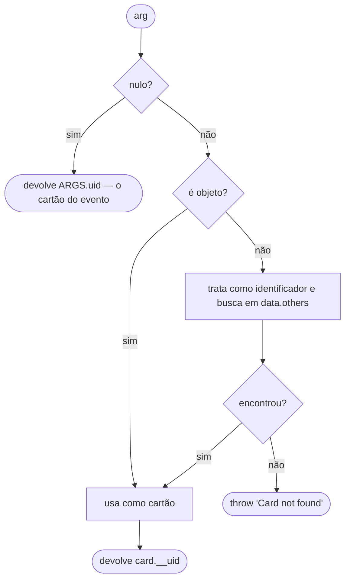

# Scripts de Evento do Usuário — Design Técnico

> Unit da extração Reversa · 2026-08-02

## Interface

### Contrato do módulo do usuário 🟢

```ts
// <workspace>/.vscode/vscode-kanban.js
module.exports = {
    onCardCreated?:   (args) => any,
    onCardDeleted?:   (args) => any,
    onCardMoved?:     (args) => any,
    onCardUpdated?:   (args) => any,
    onColumnCleared?: (args) => any,
    onExecute?:       (args) => any,
    onTrackTime?:     (args) => any,
    onEvent?:         (args) => any,   // fallback
};
```

### Argumentos entregues 🟢

| Campo | Tipo | Sempre? | Origem |
|---|---|---|---|
| `data` | any | sim | carga do evento |
| `extension` | `ExtensionContext` | sim | ⚠️ contexto completo |
| `file` | string | sim | caminho do quadro |
| `globals` | any | sim | clone de `kanban.globals` |
| `logger` | Logger | sim | logger da extensão |
| `name` | string | sim | nome do evento |
| `options` | any | não | clone de `trackTime.options` |
| `require` | `(id) => any` | sim | ⚠️ irrestrito |
| `session` | any | sim | estado da sessão do editor |
| `state` | any | sim | estado do workspace |
| `tag` | any (getter) | exceto `column_cleared` | `data.card.tag` |
| `uid` | string (getter) | exceto `column_cleared` | `data.card.__uid` |
| `setTag` | `(tag, card?) => PromiseLike<boolean>` | sim | mutação |
| `moveToTodo/InProgress/Testing/Done` | `(card?) => PromiseLike<boolean>` | sim | mutação |

### Catálogo de eventos 🟢

| Evento | Função | `data` |
|---|---|---|
| `card_created` | `onCardCreated` | `{card, column, others}` |
| `card_updated` | `onCardUpdated` | `{card, oldCard, column, others}` |
| `card_deleted` | `onCardDeleted` | `{card, column, others}` |
| `card_moved` | `onCardMoved` | `{card, from, to, others}` |
| `column_cleared` | `onColumnCleared` | `{cards, column}` |
| `execute_card` | `onExecute` | `{card, column, others}` |
| `track_time` | `onTrackTime` | `{card, column, others}` |

## Fluxo Principal

1. O Webview envia `raiseEvent` com `{name, data}` (`board.js`, seis pontos de disparo).
2. `KanbanBoard.raiseEvent` monta o contexto com `postMessage` e delega ao listener do
   `Workspace` (`boards.ts:1315-1334`).
3. `Workspace.raiseEvent` (`workspaces.ts:600-886`):
   - trata primeiro o caso `track_time` (ver unit `time-tracking`);
   - não havendo handler, verifica a existência de `.vscode/vscode-kanban.js` e o carrega com
     `loadModule` (`workspaces.ts:759-769`);
   - escolhe a função pelo nome do evento; na ausência, usa `onEvent`
     (`workspaces.ts:771-806`);
   - monta `options` clonado, define os *getters* `tag` e `uid` conforme o evento, injeta
     `setTag` e os quatro `moveTo*` (`workspaces.ts:810-878`);
   - invoca `func.apply(thisArg, [ARGS])` (`workspaces.ts:880-885`).

### Resolução de cartão nos métodos de mutação 🟢

`GET_UID(arg)` (`workspaces.ts:638-673`):



`setTag` e `MOVE_TO` enviam `setCardTag` e `moveCardTo` ao Webview, que aplica a mutação e
grava (`workspaces.ts:701-715`, `:836-859`).

## Fluxos Alternativos

- **Arquivo ausente:** o despacho encerra silenciosamente (`workspaces.ts:764-766`) 🟢.
- **Módulo sem a função do evento e sem `onEvent`:** nada acontece 🟢.
- **Erro dentro do script:** a promessa rejeita e o erro sobe pelo caminho de `raiseEvent`,
  chegando a `showError` (`boards.ts:1253-1258`) 🟢.
- **`setTag` falhando:** devolve `false` e a cópia local do cartão não é atualizada
  (`workspaces.ts:851-856`) 🟢.
- **`column_cleared`:** `setupUID` e `setupTag` ficam falsos, e os *getters* não são definidos
  (`workspaces.ts:789-791`) 🟢.
- **Erro de carga do módulo (sintaxe inválida):** 🟡 `loadModule` lança; o erro sobe sem
  tratamento específico.

## Dependências

- `boards` — origem do comando `raiseEvent` e destino de `setCardTag` / `moveCardTo`
- `time-tracking` e `integracao-toggl` — modos especiais dentro do mesmo despacho
- `configuracao-do-workspace` — `globals`, `canExecute`, `trackTime`
- `vscode-helpers` — `loadModule`, `cloneObject`, `applyFuncFor`, `SESSION`
- `board-ui` — dispara os eventos e aplica as mutações

## Decisões de Design Identificadas

| Decisão | Evidência | Confiança |
|---|---|---|
| Extensibilidade por módulo local, não por sistema de plugins (ADR-004) | `workspaces.ts:769` | 🟢 |
| `require` irrestrito, acrescentado na versão 1.4.0 | `workspaces.ts:629-633` | 🟢 ⚠️ |
| `ExtensionContext` entregue por completo | `workspaces.ts:620` | 🟢 ⚠️ |
| Fallback `onEvent` para handler genérico | `workspaces.ts:805` | 🟢 |
| `tag` e `uid` como *getters*, não como valores | `workspaces.ts:815-833` | 🟢 |
| Clonagem de `globals` e `options` | `workspaces.ts:624`, `:811` | 🟢 |
| Dois níveis de estado: `state` (workspace) e `session` (editor) | `workspaces.ts:634-635` | 🟢 |
| Mutação por mensagem ao Webview, não por alteração direta | `workspaces.ts:701-715` | 🟢 |

## Estado Interno

| Estado | Onde | Escopo |
|---|---|---|
| `_STATE` | `Workspace` | Enquanto a pasta estiver aberta |
| `vscode_helpers.SESSION` | biblioteca | Sessão do editor, compartilhado entre workspaces |

🟡 O módulo carregado é mantido em cache pelo `require` do Node: alterar o script exige
recarregar a janela do editor para que a nova versão passe a valer.

## Observabilidade

- 🟢 O script recebe `args.logger`, com acesso ao log da extensão
- 🟢 Erros lançados pelo script chegam ao usuário por `showError`
- 🔴 Não há registro de qual script foi carregado nem de qual função foi invocada: **a execução
  de código de terceiro é completamente silenciosa**

## Riscos e Lacunas

- 🔴 **Execução de código arbitrário sem confirmação (Q1).** O ativo em risco não é o quadro, é
  a máquina de quem abre a pasta. Com `activationEvents: ["*"]` e `openOnStartup` versionado no
  repositório, a ação necessária do usuário é mínima
- 🔴 Ausência de `capabilities.untrustedWorkspaces` no manifesto, deixando de usar o Workspace
  Trust do editor, disponível desde 2021
- 🟡 Módulo em cache: alterações no script não valem até recarregar a janela
- 🟡 `raiseEvent` tem cerca de 286 linhas e cinco responsabilidades — o maior método do sistema
- 🟢 Cada evento serializa todos os demais cartões em `others`, custo que cresce com o quadro
- 🟢 A gravação precede o evento: um script não consegue impedir uma operação, apenas reagir a
  ela
