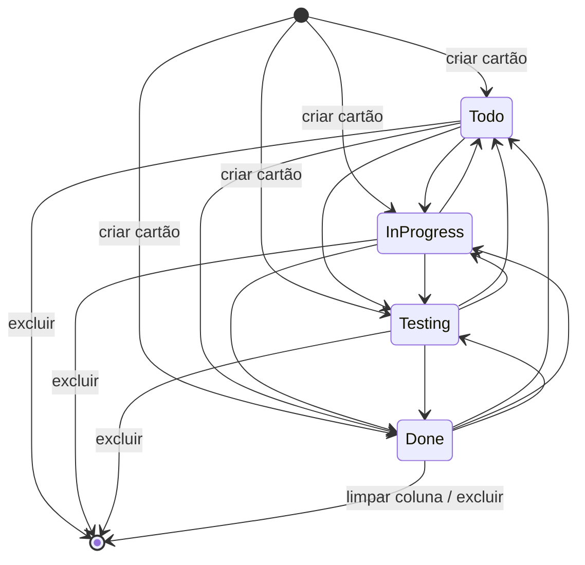
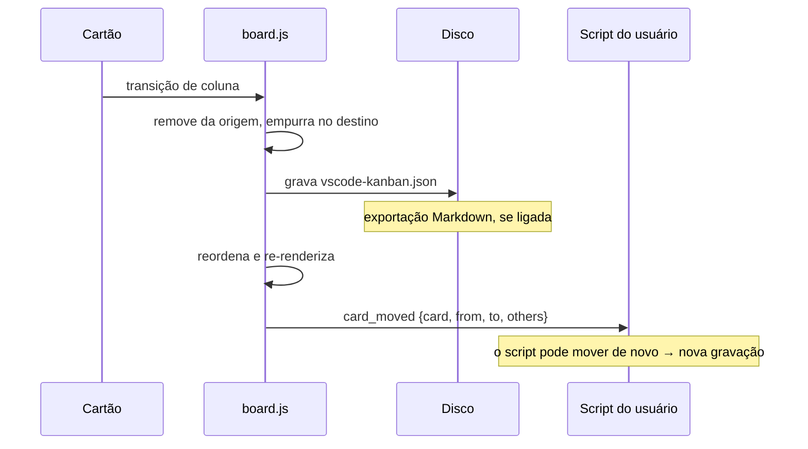
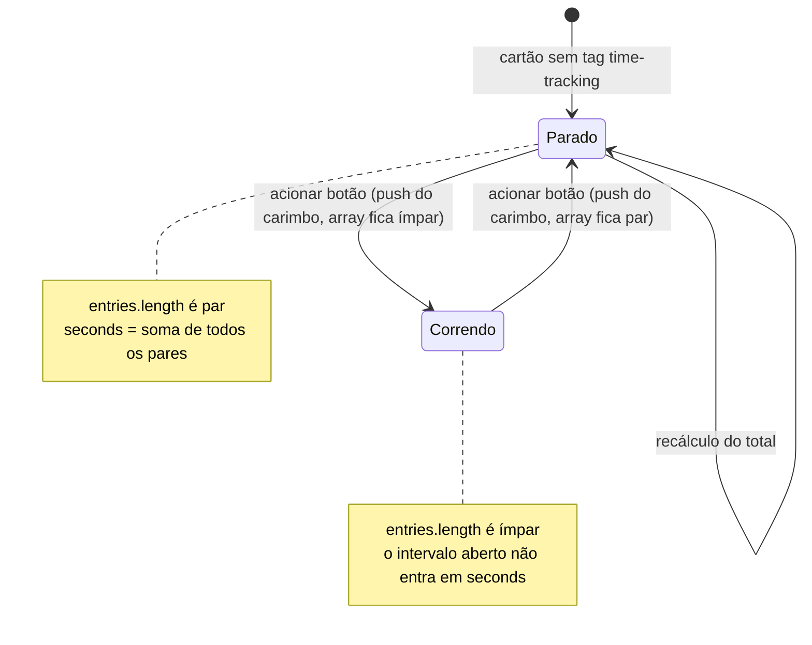
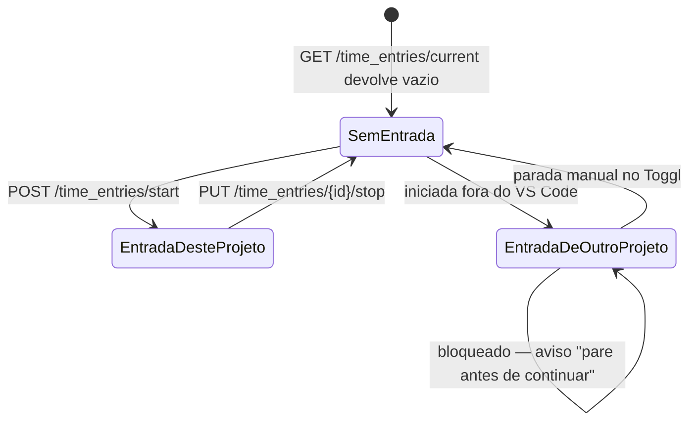
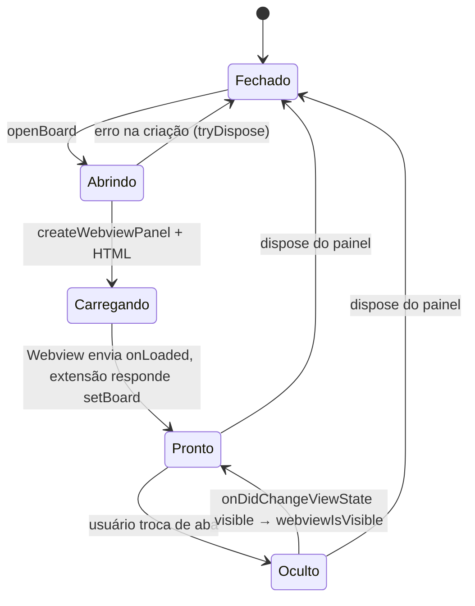
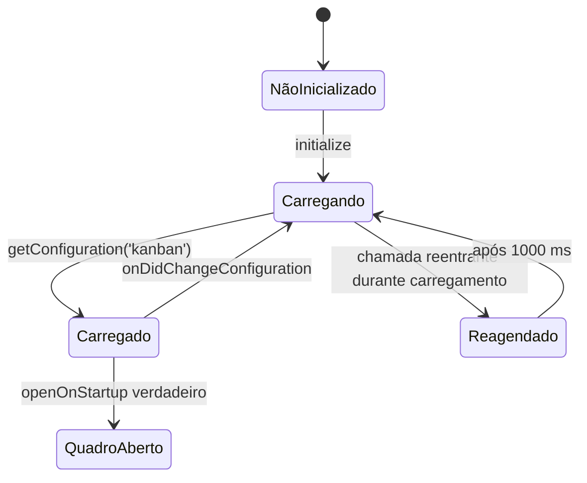
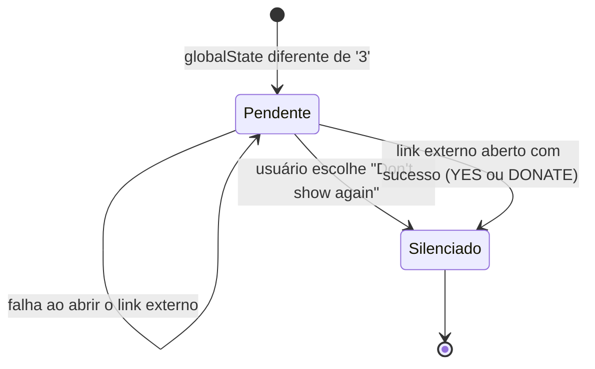

# Máquinas de Estado — vscode-kanban

> Gerado pelo **Detetive** (Reversa) em 2026-08-02
> Escala: 🟢 CONFIRMADO · 🟡 INFERIDO · 🔴 LACUNA

---

## 1. Cartão — posição no quadro 🟢

O estado do cartão **é** a coluna em que ele está. Não há campo `status`: a posição no objeto
`Board` é o estado.

### Grafo de transições

**Grafo completo** 🟢: as doze transições existem e nenhuma é restrita. `MOVE_CARD`
(`board.js:1459`) apenas remove da origem e empurra no destino, sem validar par de origem e
destino. O mesmo vale para o comando `moveCardTo` vindo de script (`board.js:1933`).

### Gatilhos

| Transição | Gatilho | Local |
|---|---|---|
| qualquer → qualquer | Botão de coluna no rodapé do cartão | `board.js:1479-1580` |
| qualquer → qualquer | `moveToTodo`, `moveToInProgress`, `moveToTesting`, `moveToDone` em script | `workspaces.ts:863-877` |
| `[*]` → coluna | Botão "+" no cabeçalho da coluna | `board.js:1877` |
| coluna → `[*]` | Botão de exclusão, com confirmação modal | `board.js:1052` |
| Done → `[*]` (em massa) | Botão "Clear" — **exclusivo da coluna Done** | `board.js:1688`, `boards.ts:508` |

🟢 **A única assimetria entre colunas** em todo o sistema: apenas Done tem o botão de limpeza
em massa (`vsckb-clear-btn`, `boards.ts:508`), com o diálogo "Do you really want to delete ALL
cards in **Done**?". As demais colunas não oferecem limpeza coletiva.

### Efeitos colaterais da transição 🟢

⚠️ Não há transação: o disco é escrito **antes** de o script rodar. Um script que rejeite a
transição não consegue desfazê-la, apenas provocar uma nova.

### O que não existe 🔴

| Ausência | Consequência |
|---|---|
| Restrição de transição (ex.: Todo não pode ir direto a Done) | Qualquer salto é permitido |
| Limite de WIP por coluna | Nenhum controle de carga |
| Histórico de transições | Não se sabe quando um cartão mudou de coluna |
| Timestamp de entrada na coluna | Impossível calcular *lead time* ou *cycle time* |

A ausência de histórico é a mais limitante: o cartão guarda `creation_time`, mas nada sobre
sua trajetória. Métricas de fluxo, que são o propósito do método Kanban, seriam impossíveis
sem mudança do modelo de dados.

---

## 2. Time tracking interno — cronômetro 🟢

Estado implícito, derivado da **paridade** do array `tag['time-tracking'].entries`.

| Estado | Condição | Mensagem exibida |
|---|---|---|
| Parado | `entries.length` par (inclusive zero) | "Time tracking has been STOPPED. Current duration: …" |
| Correndo | `entries.length` ímpar | "Time tracking has been started." |

**Invariante** 🟢: `seconds` é sempre a soma dos pares completos, recalculada integralmente a
cada acionamento (`workspaces.ts:915-937`). Corrigir o array à mão corrige o total.

**Fragilidade** 🟡: o estado vive dentro de `tag`, campo livre que scripts do usuário também
escrevem. Um script que substitua `tag` inteiro apaga o histórico de tempo sem aviso.

---

## 3. Time tracking Toggl — entrada remota 🟢

Aqui o estado é **remoto**: mora na conta Toggl, não no cartão.

| Estado observado | Ação do sistema | Local |
|---|---|---|
| Nenhuma entrada corrente | Inicia uma nova, com título do cartão e tags | `toggl.ts:226-257` |
| Entrada corrente com `pid` deste projeto | Para a entrada | `toggl.ts:258-290` |
| Entrada corrente com `pid` de outro projeto | Recusa e exibe aviso | `toggl.ts:217-224` |

🟢 O cartão **não** guarda referência à entrada Toggl. A associação é indireta, pela descrição
(título do cartão) e pelas tags, de modo que o vínculo se perde se o título mudar.

---

## 4. Painel do quadro — ciclo de vida 🟢

**Invariantes** 🟢:
- `open()` devolve `false` se `_panel` já existir, garantindo no máximo um painel por quadro
  (`boards.ts:1078-1080`).
- `retainContextWhenHidden: true` preserva o estado do Webview quando oculto, de modo que
  `allCards` sobrevive à troca de abas — a transição Oculto → Pronto **não** recarrega o
  arquivo.

🟡 Consequência de `retainContextWhenHidden`: o quadro pode ficar horas em segundo plano com
estado defasado em relação ao disco. Uma alteração externa ao arquivo (por `git pull`, por
exemplo) só é percebida com o botão "Reload Board".

---

## 5. Configuração do workspace 🟢

🟡 A transição `Carregado → QuadroAberto` dispara em **toda** mudança de configuração, não
apenas na ativação (`workspaces.ts:413`). O nome `openOnStartup` descreve a intenção, não o
comportamento efetivo.

---

## 6. Aviso de recrutamento 🟢

Única máquina de estados com persistência em `globalState` — escopo de usuário, não de
workspace, e portanto compartilhada entre todos os projetos.
