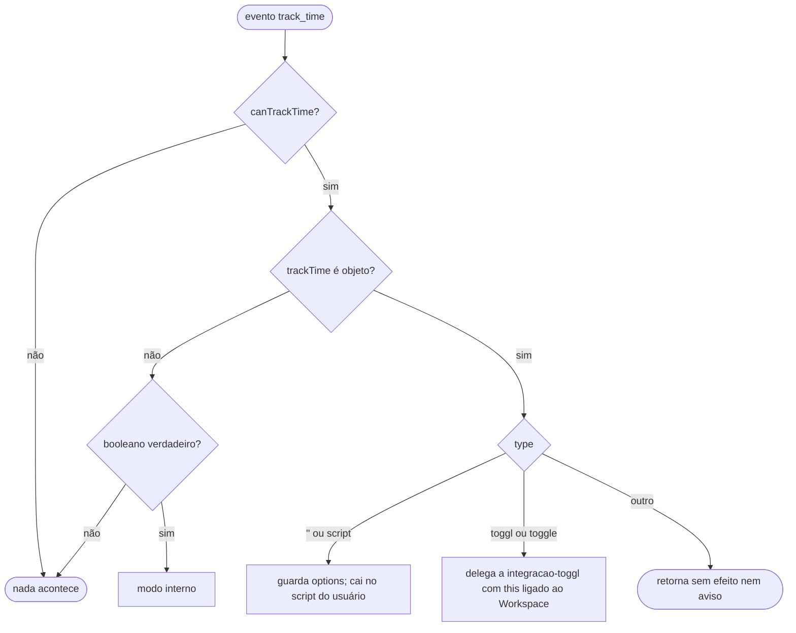

# Time Tracking — Design Técnico

> Unit da extração Reversa · 2026-08-02

## Interface

| Símbolo | Assinatura | Retorno | Observação |
|---|---|---|---|
| `Workspace.canTrackTime` | getter | `boolean` | `trackTime` não nulo e diferente de `false` |
| `Workspace.trackTime` | `(args: TrackTimeEventArguments)` | `Promise<void>` | Modo interno |
| `args.setTag` | `(tag, card?)` | `PromiseLike<boolean>` | Grava o estado no cartão |
| evento `track_time` | `{card, column, others}` | — | Disparado pelo Webview |

### Estrutura persistida 🟢

```json
{
  "tag": {
    "time-tracking": {
      "seconds": 3600,
      "entries": ["2026-08-02T10:00:00.000Z", "2026-08-02T11:00:00.000Z"]
    }
  }
}
```

## Fluxo Principal

### Despacho por modo (`raiseEvent`, `workspaces.ts:717-757`)



### Modo interno (`workspaces.ts:892-950`)

1. Se `tag` for nulo, inicializa objeto vazio.
2. Se `tag['time-tracking']` não existir, inicializa `{seconds: 0, entries: []}`.
3. Acrescenta `Moment.utc().toISOString()` ao array.
4. Percorre o array em pares acumulando a diferença em segundos; a variável `lastStartTime`
   alterna entre `false` e o instante de início.
5. Grava o total em `seconds`.
6. Chama `args.setTag(tag)`, que envia `setCardTag` ao Webview e persiste.
7. Exibe a mensagem: início se sobrou carimbo ímpar, parada com duração humanizada caso
   contrário.

## Fluxos Alternativos

- **Primeiro acionamento:** a estrutura é criada do zero 🟢.
- **`setTag` falhando:** devolve `false`; o cartão local não é atualizado, mas a mensagem já foi
  exibida (`workspaces.ts:851-856`) 🟡.
- **Carimbo inválido no array:** `Moment.utc` produz data inválida e a diferença vira `NaN`,
  contaminando o total 🟡 — não há validação.
- **Script substituindo `tag` inteiro:** o histórico de tempo é perdido silenciosamente 🟡.
- **Cartão em Todo ou Done com `noTimeTrackingIfIdle`:** o botão não é renderizado, mas o
  evento continuaria funcionando se disparado por script 🟢.

## Dependências

- `scripts-de-evento-do-usuario` — o despacho vive dentro de `raiseEvent`
- `integracao-toggl` — modo alternativo
- `gestao-de-cartoes` — o `tag` pertence ao cartão
- `configuracao-do-workspace` — `trackTime` e `noTimeTrackingIfIdle`
- `humanize-duration` — formatação da duração na mensagem
- `moment` — instantes UTC e diferenças

## Decisões de Design Identificadas

| Decisão | Evidência | Confiança |
|---|---|---|
| Carimbos alternados em vez de campo de estado explícito | `workspaces.ts:910-934` | 🟢 |
| Recálculo total a cada acionamento, em vez de acumulação incremental | `workspaces.ts:915` | 🟢 |
| Estado dentro do campo livre `tag`, compartilhado com scripts | `workspaces.ts:893` | 🟢 |
| Três modos mutuamente exclusivos governados por uma única chave | `workspaces.ts:717-757` | 🟢 |
| Falha silenciosa para `type` desconhecido | `workspaces.ts:747-748` | 🟢 |
| Ocultação por coluna introduzida na versão 1.10.0 | CHANGELOG | 🟢 |

## Estado Interno

Esta unit não guarda estado em memória: tudo vive no `tag` do cartão, portanto no arquivo do
quadro 🟢. É o único mecanismo do sistema em que o modelo de dados carrega estado temporal.

**Propriedade útil e provavelmente não intencional** 🟢: como o total é recalculado do zero,
corrigir o array `entries` à mão no JSON corrige automaticamente o total.

## Observabilidade

- 🟢 As mensagens de início e parada são o único retorno ao usuário
- 🔴 Nenhum registro em log: não há como auditar quando o cronômetro foi acionado
- 🔴 O total em andamento é invisível: o usuário não vê quanto tempo passou desde o início

## Riscos e Lacunas

- 🟡 **Colisão no campo `tag`**: um script que substitua `tag` inteiro apaga o histórico de
  tempo sem aviso
- 🟡 **Carimbos inválidos contaminam o total** com `NaN`, sem validação nem recuperação
- 🟡 A mensagem é exibida mesmo quando `setTag` falha, informando ao usuário algo que não foi
  persistido
- 🟢 Falha silenciosa para `type` desconhecido: quem digita `"toogl"` em vez de `"toggl"` fica
  sem recurso e sem explicação
- 🔴 Não há visualização do tempo acumulado além da mensagem momentânea da parada
