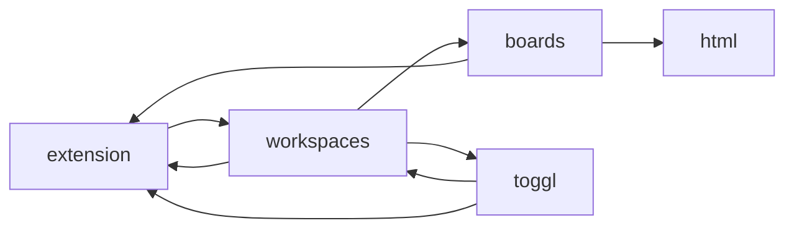

# Spec Impact Matrix — vscode-kanban

> Gerada pelo **Arquiteto** (Reversa) em 2026-08-02
> Responde à pergunta operacional: **"se eu mexer aqui, o que quebra?"**
> Escala: 🟢 CONFIRMADO · 🟡 INFERIDO

---

## 1. Matriz de impacto entre módulos

Leitura: a linha impacta a coluna. `●` impacto direto (dependência explícita), `○` impacto
indireto (via terceiro ou contrato compartilhado).

| ↓ impacta → | extension | workspaces | boards | html | toggl | announcements | board-ui | webview-utils |
|---|:---:|:---:|:---:|:---:|:---:|:---:|:---:|:---:|
| **extension** | — | ● | ○ | | ○ | ● | ○ | |
| **workspaces** | ● | — | ● | ○ | ● | | ○ | |
| **boards** | ● | ○ | — | ● | | | ● | ○ |
| **html** | | | ○ | — | | | ● | ● |
| **toggl** | ● | ● | | | — | | | |
| **announcements** | | | | | | — | | |
| **board-ui** | | ○ | ● | | | | — | ● |
| **webview-utils** | | | | | | | ● | — |

### Ciclos confirmados 🟢

Três ciclos: `extension ⇄ workspaces`, `extension → workspaces → boards → extension` e
`workspaces ⇄ toggl`. O primeiro é resolvido em tempo de execução por *monkey patching*
(`extension.ts:294`); os demais funcionam porque o uso é sempre tardio, dentro de funções, e
nunca no corpo do módulo.

**Consequência prática:** nenhum módulo TypeScript pode ser importado isoladamente num teste
sem carregar a árvore inteira. É a barreira técnica imediata para escrever o primeiro teste.

---

## 2. Impacto por artefato compartilhado

Mudar um destes contratos atinge **os dois lados da ponte** ao mesmo tempo:

| Contrato | Definido em | Consumido por | Risco de mudança |
|---|---|---|---|
| Interface `Board` / `BoardCard` | `boards.ts:32-104` | `workspaces.ts`, `board.js`, exportação, arquivos gravados de todos os usuários | 🔴 Alto — quebra dados existentes |
| `BOARD_COLMNS` | `boards.ts:388` | `boards.ts`, `workspaces.ts`, `board.js`, HTML dos modais | 🔴 Alto — quatro pontos, dois idiomas |
| Protocolo de mensagens (12 comandos) | `boards.ts:1119`, `board.js:1930` | Os dois containers | 🔴 Alto — precisa mudar nos dois lados juntos |
| `BoardSettings` | `boards.ts:128-166` | `workspaces.ts:574`, `board.js:489` | 🟡 Médio |
| `EventScriptFunctionArguments` | `workspaces.ts:213` | **Scripts de usuário fora do repositório** | 🔴 Alto — contrato público não versionado |
| Vocabulário de `type` | `board.js:807`, `:2099`, `workspaces.ts:1055` | Filtro, cores, ordenação, exportação | 🟡 Médio — já inconsistente |
| Ambiente do filtro (valores e funções) | `script.js:63`, `board.js:838` | Filtros salvos pelos usuários | 🟡 Médio — quebra filtros existentes |
| Nomes dos arquivos em `.vscode/` | `workspaces.ts:310-314` | Instalações existentes | 🔴 Alto |

O contrato mais perigoso é o **`EventScriptFunctionArguments`**: é API pública consumida por
código que não está neste repositório, jamais foi versionada, e cuja quebra só aparece em
tempo de execução na máquina do usuário.

---

## 3. Impacto por mudança pretendida

Cenários prováveis de evolução, com o que cada um arrasta:

### C1 — Restringir `activationEvents` (ADR-007)

| Toca | Arrasta | Risco |
|---|---|---|
| `package.json:21` | `openOnStartup` deixa de funcionar sem `workspaceContains` | 🟢 Baixo |

Menor mudança de maior benefício. Uma linha, sem tocar em código.

### C2 — Declarar `untrustedWorkspaces` e confirmar execução de script (ADR-004)

| Toca | Arrasta | Risco |
|---|---|---|
| `package.json` (capabilities) | Comportamento em pastas não confiáveis | 🟢 Baixo |
| `workspaces.ts:759-808` | Fluxo de `raiseEvent`; scripts existentes passam a exigir confirmação | 🟡 Médio |

### C3 — Restringir `localResourceRoots` e acrescentar CSP (C2 e C3 de segurança)

| Toca | Arrasta | Risco |
|---|---|---|
| `boards.ts:922-932` | CSS customizado do usuário em `~` deixaria de carregar | 🟡 Médio |
| `html.ts:160-226` | CSP pode quebrar scripts inline e recursos vendorizados | 🔴 Alto — exige teste manual de toda a interface |

### C4 — Sanitizar o Markdown de verdade (C4 de segurança)

| Toca | Arrasta | Risco |
|---|---|---|
| `script.js:227-296` | HTML embutido nos cartões existentes pode deixar de renderizar | 🟡 Médio |
| Dependência nova (DOMPurify) vendorizada | ADR-003 — mais uma biblioteca sem rastreio | 🟡 Médio |

### C5 — Corrigir a mutação in place da ordenação (ADR-006)

| Toca | Arrasta | Risco |
|---|---|---|
| `board.js:465` | Ordem persistida deixa de mudar sozinha; comportamento visível idêntico | 🟢 Baixo |

Uma linha (`.slice().sort(...)`), efeito colateral eliminado.

### C6 — Extrair o domínio do Webview (ADR-008)

| Toca | Arrasta | Risco |
|---|---|---|
| `board.js` inteiro | Renderização, filtro, ordenação, CRUD | 🔴 Muito alto |
| `boards.ts` protocolo | Doze comandos precisam ser repensados | 🔴 Muito alto |
| `workspaces.ts` | Passa a manter estado | 🔴 Alto |
| Scripts de usuário | `args.data.others` muda de forma | 🔴 Alto |

É a "grande refatoração" anunciada em 2020. **Não deve ser tentada sem testes de
caracterização prévios.**

### C7 — Migrar o toolchain (`vscode` → `@types/vscode`)

| Toca | Arrasta | Risco |
|---|---|---|
| `package.json` devDependencies e scripts | `postinstall` e `test` mudam de forma | 🟡 Médio |
| `src/test/index.ts` | O runner atual vem do pacote deprecado | 🟡 Médio |

**Pré-requisito de tudo o mais**: sem isso, é provável que `npm install` sequer complete hoje.

---

## 4. Cobertura de teste por área de impacto 🟢

| Área | Testes existentes | Risco de regressão silenciosa |
|---|---|---|
| Normalização da carga | nenhum | 🔴 Alto |
| Geração de `id` | nenhum | 🔴 Alto |
| Ordenação | nenhum | 🔴 Alto |
| Filtro | nenhum | 🔴 Alto |
| Exportação Markdown | nenhum | 🔴 Alto |
| Time tracking interno | nenhum | 🔴 Alto |
| Cliente Toggl | nenhum | 🔴 Alto |
| Despacho de eventos | nenhum | 🔴 Alto |
| Protocolo de mensagens | nenhum | 🔴 Alto |
| Geração de HTML | nenhum | 🟡 Médio (falha é visível) |

**Nenhuma área tem cobertura.** A suíte contém duas asserções sobre `Array.indexOf`.

### Ordem sugerida para os primeiros testes 🟡

Critério: função quase pura, alto risco, baixo custo de isolar.

1. `vsckb_get_cards_sorted` — entrada e saída puras, três critérios encadeados
2. Normalização de conteúdo (`SET_CARD_CONTENT`) — pura, quatro casos
3. `FIND_NEXT_SIMPLE_CARD_ID` — pura, com o caso de borda do quadro vazio
4. `exportBoardCardsTo` — efeito no disco, mas contrato claro e testável com diretório temporário
5. `trackTime` interno — a soma dos pares é aritmética verificável
6. `vsckb_does_match` — depende de Filtrex carregado, mas o contrato é booleano

---

## 5. Matriz consolidada: risco × esforço 🟡

| Mudança | Risco | Esforço | Benefício | Ordem |
|---|---|---|---|---|
| C7 · Migrar toolchain | 🟡 | Médio | Destrava tudo | **1** |
| Testes de caracterização (itens 1 a 3) | 🟢 | Médio | Rede de segurança | **2** |
| Lint e teste no CI | 🟢 | Baixo | Impede regressão publicada | **3** |
| C5 · Ordenação sobre cópia | 🟢 | Trivial | Elimina *diff* espúrio | **4** |
| C1 · `activationEvents` | 🟢 | Trivial | Ganha inicialização para todos | **5** |
| C2 · Workspace Trust | 🟢 | Baixo | Fecha a exposição maior | **6** |
| C4 · Sanitização | 🟡 | Médio | Fecha execução de script no Webview | **7** |
| C3 · CSP e raízes de recurso | 🔴 | Médio | Reduz superfície do Webview | **8** |
| C6 · Extrair domínio | 🔴 | Muito alto | Viabiliza tudo a longo prazo | **9** |
